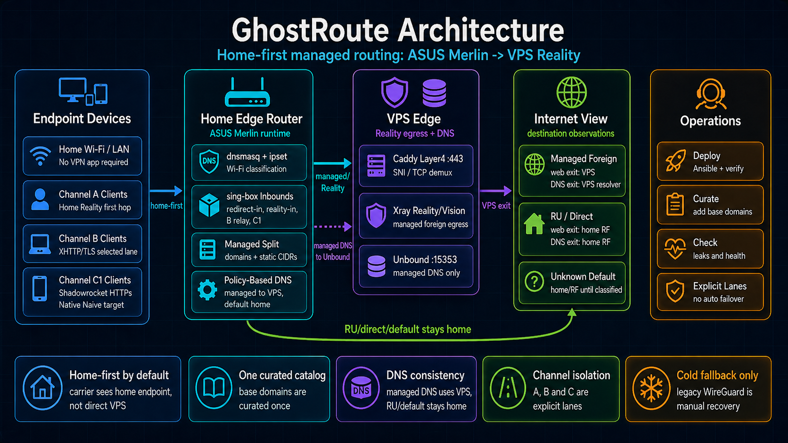

# GhostRoute

### Reality-маршрутизация на ASUS Merlin: домашний ingress для мобильных клиентов и управляемый Reality egress

[](LICENSE)
[](https://github.com/eiler2005/ghostroute/actions/workflows/ci.yml)
[](https://github.com/RMerl/asuswrt-merlin.ng)
[]()
[]()

> Домашние устройства работают как обычно. Роутер сам решает, какой канал нужен каждому направлению.

**[English version ->](README.md)**

Политика документации: English README — developer-facing ground truth; русская
версия — operator-facing summary. Если EN и RU расходятся, источник истины —
EN. Расширенные технические разделы (Quick Start, ADR index, Demo, полная
таблица каналов) намеренно живут только в EN, чтобы не дублировать дрейф.

Карта того, что установлено на ASUS Merlin router, с runtime-файлами,
watchdog'ами и схемами каналов:
[`docs/router-runtime-map.md`](docs/router-runtime-map.md).

## Статус каналов

| Канал | Статус | Первый hop | Scope | Автоматический failover |
|---|---|---|---|---|
| A | Production router data plane | Endpoint или LAN -> home router | LAN split routing, selected full-VPS sets, Home Reality clients, active managed Reality egress | Нет |
| B | Production для selected device-client профилей | Endpoint -> home router XHTTP/TLS ingress | Protocol-diverse home-first client lane через managed split | Нет |
| C | C1-Shadowrocket live compatibility + C1-sing-box native Naive design | Endpoint -> home router HTTPS CONNECT или Naive ingress | Home-first selected-client lane; C1-SR iPhone-proven, C1-sing-box server-ready, заблокирован SFI 1.11.4 | Нет |
| D | Experimental router-native NaiveProxy lab | Endpoint -> home router Caddy forward_proxy@naive на `:<channel-d-public-port>` | Karing/NaiveProxy-style proof lane через тот же managed split; выключен по умолчанию | Нет |
| M | Service MAX egress lane | home router -> SSH remote-forward -> maxtg_bridge VPS docker bridge | Только MAX API/CDN, authenticated HTTP CONNECT внутри reverse-туннеля, direct-out через home WAN | Нет |
| WireGuard | Cold fallback only | Manual emergency script | Catastrophic Reality outage recovery | Нет |

---

## Обзор

GhostRoute — layered routing setup для endpoint-клиентов, домашнего ASUS Merlin
роутера и удаленного VPS egress. Отдельно есть служебный reverse Channel M для
MAX трафика `maxtg_bridge`: роутер сам открывает исходящий SSH remote-forward
на VPS, bridge подключается к VPS-local listener по authenticated HTTP CONNECT,
а роутер выпускает этот поток через домашний РФ WAN. Домашние устройства могут оставаться без
клиентских VPN-приложений, а managed endpoint-клиенты могут применять
собственную first-hop routing policy еще до входа на домашний роутер. Базовый
режим — managed-domain split, но выбранные домашние Wi-Fi/LAN устройства и
выбранные Channel A Home Reality профили могут быть переведены в full-VPS mode:
весь internet-bound трафик идет через `reality-out`, а local/private остается
локальным.



Модель слоев разделяет основные traffic-задачи:

- Layer 0 — endpoint/client-side routing. Клиентское приложение или системный
  VPN-профиль может выбрать `DIRECT` или `MANAGED/PROXY` до входа в GhostRoute.
  Например, Shadowrocket на iPhone/iPad/MacBook может использовать domain, IP,
  GEOIP и rule-list policy; это routing layer, а не просто VPN toggle.
- Layer 1 — managed channels. Channel A, Channel B, Channel C и experimental
  Channel D работают home-first:
  первая сеть видит endpoint -> home endpoint, а не endpoint -> VPS. Channel C
  теперь разделен на C1-Shadowrocket HTTPS CONNECT compatibility и C1-sing-box
  native Naive target. Channel D — выключенный по умолчанию router-native
  Caddy `forward_proxy@naive` lab на `:<channel-d-public-port>`, который заводит трафик в
  `channel-d-naiveproxy-socks-in` и тот же managed split. Channel M стоит
  отдельно: это service-only reverse SSH
  lane для MAX egress из `maxtg_bridge`, а не клиентский failover.
- Layer 2 — home router. Он завершает home-based channels и применяет managed
  split через `STEALTH_DOMAINS` / `VPN_STATIC_NETS`, плюс optional Channel A
  selected full-VPS override для выбранных устройств/профилей. Channel M не
  участвует в split и route rule ведет его inbound напрямую в `direct-out`.
- Layer 3 — VPS. Он служит удаленным egress для выбранного managed traffic.

Production endpoint policy в этом репозитории остается country-neutral:
local/private/captive и trusted domestic направления идут `DIRECT`; non-local,
foreign, unknown или selected направления идут `MANAGED/PROXY`; `FINAL`
указывает на `MANAGED/PROXY` в country-aware deployment profiles. Конкретные
country suffixes, GEOIP lists и service lists относятся к private deployment
profiles, а не к общей архитектуре.

Только Channel A входит в automatic router data plane. Channel B — production
lane для selected device-client profiles с отдельным ingress/relay и без
захвата Channel A REDIRECT. Channel C означает только C1 home-first на роутере:
C1-Shadowrocket compatibility live-proven и C1-sing-box native Naive
server-ready/client-blocked, а не VPS-only backend.
Автоматический failover через B/C не включается.
Channel M не является failover для A/B/C и не использует `reality-out`: это
отдельный служебный MAX API/CDN egress через домашний WAN.

Runtime ownership, порты и invariants для redeploy описаны в
[docs/channel-m-environment.md](docs/channel-m-environment.md).

Legacy WireGuard (`wgs1` + `wgc1`) выключен в нормальной эксплуатации.
`wgc1_*` NVRAM сохранён только как cold fallback.

Если роутер показывает WAN `carrier=0` или "сетевой кабель не подключен", это
физическая/провайдерская авария WAN-link. Это не признак поломки Channel A,
Caddy/VPS или Reality/Vision data plane.

## Операторский доступ к роутеру

Для SSH-доступа к роутеру есть два штатных пути:

- **Домашняя LAN/Wi-Fi:** можно использовать LAN-адрес роутера, например
  `ROUTER_LAN=<router_lan_ip>` и `ROUTER_LAN_PORT=22`, только когда control
  machine реально находится в домашней сети.
- **Удаленно / не из домашней сети:** основной путь — выделенный внешний SSH
  endpoint и отдельный порт роутера. Локально он задается в gitignored
  `secrets/router.env` и использует ключ из `secrets/router-remote-ssh/`; в
  Ansible/VPS окружении тот же смысл задают Vault-переменные
  `ghostroute_router_remote_*`.

Общий helper по умолчанию работает в `ROUTER_ACCESS_MODE=auto`: если маршрут от
control machine к `ROUTER_LAN` идет через обычный LAN-интерфейс, используется
`ROUTER_LAN:22`; если маршрут идет через VPN-интерфейс вроде `utun`, `tun`,
`wg` или Tailscale, helper оставляет WAN/remote `ROUTER:ROUTER_WAN_PORT` из
`secrets/router.env`. `ROUTER_PORT` остается legacy fallback для старых local
env files. Поэтому `./verify.sh`, `live-check`, health reports и read-only
diagnostics автоматически выбирают правильный SSH-путь. Реальный host, port и
ключ не фиксируются в tracked docs и не коммитятся.

В `auto` режиме helper делает короткий SSH-preflight, а не только TCP port
probe. Если WAN endpoint принимает TCP, но не отдает SSH banner, helper пробует
direct LAN/Wi-Fi fallback и только потом возвращает transport diagnostic.

---

## Возможности

- Domain-based routing через `dnsmasq` + `ipset`.
- Единый активный каталог для домашней LAN (`STEALTH_DOMAINS`).
- Общий static CIDR каталог для direct-IP сервисов через `VPN_STATIC_NETS`.
- Optional Layer 0 endpoint/client-side routing для устройств с rule-based
  client profiles, например Shadowrocket-style configs.
- Channel A VLESS+Reality+Vision egress через VPS host за общим Caddy L4 на TCP/443.
- Optional Channel A selected full-VPS set: выбранные домашние Wi-Fi/LAN
  устройства или Home Reality профили могут целиком выходить через VPS, пока
  остальные устройства сохраняют managed-domain split. Это Channel A override,
  а не failover через B/C.
- Channel B selected-client production home-first lane: выбранные устройства сначала
  подключаются к домашнему ingress через XHTTP/TLS, затем роутер relays трафик
  в локальный sing-box SOCKS и переиспользует Reality/Vision upstream на VPS
  `:443`.
- Channel C C1 lane: C1-Shadowrocket использует HTTPS CONNECT/TLS как
  live-proven iPhone compatibility path; C1-sing-box использует router-side
  native Naive, но пока ожидает iOS client support for outbound `type: naive`.
  Оба варианта применяют тот же managed split и Reality/Vision upstream.
- Channel D Karing-only NaiveProxy lane: выбранные клиенты Karing подключаются
  к домашнему TCP/<channel-d-public-port>, router-native Caddy `forward_proxy@naive` relays трафик
  в `channel-d-naiveproxy-socks-in`, а sing-box применяет тот же managed split.
  Server-side build pinned на `klzgrad/forwardproxy`, но live fingerprint
  остается Karing-like; cover site отвечает на обычный unauthenticated HTTPS
  GET. Channel D выключен по умолчанию и не является Channel C proof.
- Channel M service lane для `maxtg_bridge`: домашний роутер открывает SSH
  remote-forward на Hetzner/VPS docker bridge; bridge использует authenticated
  HTTP CONNECT внутри этого туннеля, а router-side sing-box ведет
  `channel-m-maxtg-reverse-egress` только в `direct-out`, чтобы MAX API/CDN
  видел домашний РФ WAN IP.
- Router-side VLESS+Reality ingress на TCP/<home-reality-port> для удаленных
  клиентов: первая сеть видит home endpoint, а не VPS endpoint.
- Стабильный router-side `sing-box` TCP REDIRECT вместо нестабильного Merlin TUN routing.
- Auto-discovery доменов, который пишет только `STEALTH_DOMAINS`.
- Локальная генерация QR/VLESS-профилей из Ansible Vault.
- Health, traffic и catalog reports для человека и LLM handoff.
- Локальный модуль мониторинга работоспособности с `STATUS_OK` /
  `STATUS_FAIL`, `summary-latest.md` и внутренними alert-журналами на диске
  роутера.

---

## Операционные модули

GhostRoute устроен как небольшая операционная платформа вокруг routing core, а
не просто набор firewall-скриптов:

- **Routing Core** — production data plane: классификация через dnsmasq/ipset,
  sing-box REDIRECT, selected full-VPS TPROXY и home Reality ingress, managed
  Reality egress на VPS, direct-out fallback для non-selected non-managed
  traffic и WireGuard cold fallback.
- **Модуль мониторинга работоспособности GhostRoute** — read-only контроль
  схемы router + VPS. Он формирует локальные `STATUS_OK` / `STATUS_FAIL`,
  `status.json`, Markdown-сводки, daily digest и alert-журналы на диске
  роутера, не меняя production routing state.
- **Traffic Observatory** — отчеты по WAN, LAN/Wi-Fi, Home Reality QR-клиентам,
  популярным назначениям и возможным ошибкам split-routing. По умолчанию
  вывод безопасно редактирует имена устройств, но локально может показывать
  понятные алиасы.
- **GhostRoute Console** — read-only web-консоль над подготовленными
  evidence-снимками: route, traffic, client, health, live и catalog. Полные
  desktop-страницы плюс компактные mobile `/m`-страницы; консоль читает
  готовые модели, а не управляет роутером/VPS. См.
  [modules/ghostroute-console/README.md](/modules/ghostroute-console/README.md).
- **Routing Policy Principles** — компактный contract: endpoint policy, channel
  ingress, router managed split и VPS/home egress. См.
  [docs/routing-policy-principles.md](/docs/routing-policy-principles.md).
- **DNS Policy** — channel proof guidance: главное — отсутствие DNS leak в
  мобильного оператора; resolver geography через BrowserLeaks — вторичный
  consistency-сигнал. См. [docs/dns-policy.md](/docs/dns-policy.md).
- **DNS & Catalog Intelligence** — наблюдение за DNS lookup, discovery доменов
  и обслуживание managed-каталогов. Модуль помогает понять, какие домены
  использует конкретный сервис, разделяет ручные и auto-discovered правила и
  наполняет `STEALTH_DOMAINS` / `VPN_STATIC_NETS` без VPN-приложений на
  домашних устройствах.
- **Performance Diagnostics Toolkit** — диагностика latency, retransmits,
  TCP tuning, MSS clamp, keepalive и симптомов LTE/Home Reality, чтобы
  проблемы быстродействия разбирать отдельно от корректности маршрутизации.
- **SNI Rotation Guide for Reality** — operational guide для проверки, ротации
  и документирования Reality cover SNI: совместимость, regional reachability и
  rollback-сценарии.
- **Client Profile Factory** — локальная генерация и очистка QR/VLESS-профилей
  из Ansible Vault: отдельные flows для router identity, home-mobile клиентов,
  emergency-профилей и будущих Channel B/C artifacts. Сгенерированные
  credentials остаются вне git.
- **Secrets Management** — Ansible Vault templates, правила хранения локальных
  секретов, изоляция generated artifacts и repo-specific `secret-scan`, который
  ловит реальные URI, UUID, ключи, публичные endpoints и production literals до
  push.
- **Recovery & Verification Toolkit** — `verify.sh`, Ansible verification,
  incident runbooks и явные cold-fallback скрипты для контролируемого ручного
  восстановления, если Reality, VPS, DNS или routing invariants ушли в drift.

Вместе эти модули делают репозиторий auditable: routing, health, traffic,
performance и recovery описаны как отдельные операционные поверхности с
read-only диагностикой и явными ручными шагами восстановления. Полная карта
модулей: [docs/operational-modules.md](/docs/operational-modules.md).

---

## Архитектура в одном срезе

```text
                         Control machine
                deploy.sh / Ansible / reports / vault
                              |
                              v
Layer 0 endpoint/client routing
  local/private/captive/trusted domestic -> DIRECT
  foreign/non-local/unknown/selected     -> MANAGED/PROXY
  FINAL                                  -> MANAGED/PROXY
                  |
                  v
Layer 1 managed channels
  Channel A -> endpoint -> home endpoint :<home-reality-port>
            -> ASUS sing-box Reality inbound
  Channel B -> endpoint -> VLESS+XHTTP+TLS -> home endpoint :<home-channel-b-port>
            -> router local Xray XHTTP/TLS ingress
  Channel C -> endpoint -> Naive/HTTPS-H2-CONNECT-like
            -> home endpoint :<home-channel-c-public-port>
            -> router sing-box Naive ingress
  Channel D -> Karing/Naive -> home endpoint :<channel-d-public-port>
            -> router Caddy forward_proxy@naive
            -> sing-box channel-d-naiveproxy-socks-in
  Channel M -> maxtg_bridge container -> HTTP CONNECT
            -> VPS docker bridge :<channel-m-reverse-listen-port>
            -> router-initiated SSH remote-forward
            -> router sing-box loopback HTTP inbound
                  |
                  v
Layer 2 home router
  Home Wi-Fi/LAN DNS -> dnsmasq + ipset
                              |
                              +-- managed DNS lookup
                              |     dnsmasq server=/managed/127.0.0.1#<dnscrypt-port>
                              |     -> dnscrypt-proxy -> sing-box SOCKS
                              |     -> reality-out -> dnscrypt upstream
                              |
                              +-- selected full-VPS override
                              |     reserved source IP / Home Reality auth_user
                              |     -> TPROXY или reality-in rule
                              |     -> reality-out -> active managed egress -> Internet
                              |
                              +-- managed match
                              |     STEALTH_DOMAINS / VPN_STATIC_NETS
                              |     -> sing-box REDIRECT / reality-in
                              |     -> VLESS+Reality outbound
                              |     -> active managed egress -> Internet
                              |
                              +-- non-managed match
                                    -> direct-out -> home WAN -> Internet

  Channel M MAX service traffic
                              |
                              +-- inbound tag channel-m-maxtg-reverse-egress
                                    -> direct-out -> home WAN -> Internet

Layer 3 VPS
  remote egress for managed traffic and selected full-VPS traffic
  sites see VPS IP for managed and selected full-VPS traffic

Operational layer:
  Routing Core        -> dnsmasq/ipset/sing-box/Reality split
  Health Monitor      -> STATUS_OK/FAIL, summaries, local alerts
  Traffic Observatory -> WAN/LAN/Home Reality usage and routing checks
  DNS Intelligence    -> lookup evidence, domain discovery, catalog review
  Performance Toolkit -> RTT/retransmit/TCP/MSS diagnostics
  SNI Rotation Guide  -> Reality cover validation, rotation, rollback
  Client Profiles     -> QR/VLESS, selected-client B/C/D artifacts from Vault
  Secrets Management  -> vault, generated artifacts, secret-scan
  Recovery Toolkit    -> verify.sh, Ansible verify, runbooks, cold fallback
```

---

## Как это работает

### 1. Домашние Wi-Fi / LAN устройства

```text
Home Wi-Fi / LAN devices
      |
      +-- DNS query
      |     |
      |     v
      |  dnsmasq
      |  +-- managed domain -> STEALTH_DOMAINS
      |  +-- static network -> VPN_STATIC_NETS
      |  +-- other domain   -> normal DNS path
      |
      +-- TCP connection to matched IP
            |
            v
      ASUS Router / Merlin
      +-- nat REDIRECT :<lan-redirect-port>
      +-- sing-box redirect inbound
      +-- VLESS+Reality TCP/443
            |
            v
      VPS host
      +-- shared Caddy :443
      +-- Xray Reality inbound
            |
            v
      Internet
```

Домашним устройствам не нужны VPN-приложения. Роутер видит DNS-ответы, наполняет `STEALTH_DOMAINS`, перехватывает совпавший TCP-трафик в sing-box и отправляет его через Reality. UDP/443 для managed-направлений отклоняется, чтобы приложения fallback'ились с QUIC на TCP.

Выбранные домашние Wi-Fi/LAN устройства могут работать в Channel A selected
full-VPS mode: reserved source IP попадает в TPROXY, затем в
`channel-a-selected-lan-full-vps-in -> reality-out`. Local/private traffic
остается локальным. Plain DNS `:53` от таких selected устройств тоже
перехватывается и destination-overridden на strict resolver перед выходом через
`reality-out`, а остальные домашние устройства сохраняют managed-domain split.

### 2. Endpoint / client-side routing

```text
Endpoint device
  -> optional client-side rules
       local/private/captive/trusted domestic -> DIRECT
       foreign/non-local/unknown/selected     -> MANAGED/PROXY
       FINAL                                  -> MANAGED/PROXY
  -> selected managed channel
```

Layer 0 может существовать на любом endpoint, где клиент поддерживает
rule-based routing. Shadowrocket на iPhone/iPad/MacBook — основной пример
сегодня: config file может выбирать `DIRECT` или `PROXY/MANAGED` по domain,
IP, GEOIP или rule list до того, как traffic попадет в Channel A/B/C.
Устройства без Layer 0 policy по-прежнему могут полагаться на router-managed
split на Layer 2.

### 3. Remote QR / VLESS-клиенты

```text
Endpoint outside home
      |
      v
Client app imports generated QR profile
      |
      v
Home public IP :<home-reality-port>
      |
      v
ASUS Router / Merlin
+-- sing-box home Reality inbound
+-- managed destination
|     +-- STEALTH_DOMAINS / VPN_STATIC_NETS
|     +-- sing-box Reality outbound
|     +-- active managed egress
|     +-- Internet
+-- selected full-VPS Home Reality profile
|     +-- auth_user rule before managed split
|     +-- private/local direct
|     +-- other internet destinations -> active managed egress
+-- non-managed destination
      +-- sing-box direct outbound
      +-- home WAN
      +-- Internet
```

Для Channel A/B managed traffic первая сеть видит подключение endpoint к home
endpoint, а не напрямую к active managed egress. Home ISP видит tunnel home
router -> active managed egress. Managed-сайты/checker видят active managed
exit. Non-managed сайты видят home WAN IP, кроме явно выбранных Channel A
full-VPS профилей.

Подробная схема с полным workflow, портами, компонентами и таблицей "кто что
видит": [modules/routing-core/docs/network-flow-and-observer-model.md](/modules/routing-core/docs/network-flow-and-observer-model.md).

### 4. Cold fallback

WireGuard не активен в steady state. Сохранённый `wgc1_*` NVRAM используется только через `modules/recovery-verification/router/emergency-enable-wgc1.sh` при катастрофическом отказе Reality.

### 5. Channel B/C/D device profiles

Channel B, Channel C и Channel D — device-client линии с разным уровнем зрелости.
Channel B работает как production lane для selected clients: выбранные устройства
подключаются к отдельному домашнему XHTTP/TLS ingress на роутере. Локальный
Xray завершает первый hop и передает трафик в локальный sing-box SOCKS, где
managed домены продолжают идти через существующий Reality/Vision upstream на VPS,
а non-managed — сразу в home WAN.
Channel C теперь разделен на два C1-варианта. C1-Shadowrocket подключается к
домашнему HTTPS CONNECT/TLS ingress на `:<channel-c-shadowrocket-public-port>` и попадает в
`channel-c-shadowrocket-http-in`; это compatibility, не native Naive.
C1-sing-box подключается к домашнему Naive ingress и попадает в
`channel-c-naive-in`; серверная часть готова, но протестированный iPhone SFI
`1.11.4` не поддержал outbound `type: naive`. Оба варианта используют общий
managed split.
Channel D — отдельный experimental router-native NaiveProxy lab: Karing или
NaiveProxy-style клиент подключается к домашнему `:<channel-d-public-port>`, Caddy
`forward_proxy@naive` на роутере принимает первый hop и передает трафик в
локальный sing-box SOCKS `channel-d-naiveproxy-socks-in`. Managed destinations
идут через `reality-out`, non-managed — через `direct-out`. Это не доказательство
Channel C native Naive и не замена C1.

Границы изоляции Channel B жесткие: отдельный ingress-port и локальный relay на
роутере без захвата Channel A REDIRECT, router DNS, TUN state и automatic
failover. Artifacts в
`ansible/out/clients-channel-b/`
считаются selected-client production credentials. Artifacts в
`ansible/out/clients-channel-c/` считаются explicit C1 selected-client
artifacts: C1-Shadowrocket live-proven, C1-sing-box native target.
`ansible/out/clients-channel-d/` считаются experimental Channel D credentials.

### 6. Channel M MAX service egress

Channel M — служебный канал для `maxtg_bridge`, а не client failover. Bridge на
Hetzner подключается к VPS-local listener по authenticated HTTP CONNECT, а этот
listener существует за счет исходящего SSH remote-forward с домашнего роутера.
Router-side sing-box принимает поток как `channel-m-maxtg-reverse-egress` и
сразу ведет его в `direct-out`, чтобы MAX API/CDN видел домашний WAN IP.
Channel M не участвует в `STEALTH_DOMAINS`, `VPN_STATIC_NETS`, Reality egress,
policy DNS, A/B/C ownership и LAN/Wi-Fi routing.

Опциональный direct public `channel-m-maxtg-max-egress` остается в проекте как
документированный экспериментальный вариант, но штатная схема — reverse
Channel M: ей не нужен новый входящий public port на доме, и она не использует
и не меняет Channel C.

---

## Технический стек

```text
Router:
  ASUS RT-AX88U Pro + Asuswrt-Merlin
  dnsmasq + ipset + iptables
  sing-box REDIRECT inbound on :<lan-redirect-port>
  optional Channel A selected full-VPS TPROXY inbound on :<full-vps-tproxy-port>
  sing-box home Reality inbound on :<home-reality-port>
  optional Channel B home XHTTP/TLS ingress on :<home-channel-b-port>
  optional Channel B local Xray relay к sing-box SOCKS на 127.0.0.1:<router-socks-port>
  optional Channel C1 Naive ingress on :<home-channel-c-ingress-port>
  optional Channel M MAX egress HTTP inbound on :<home-channel-m-ingress-port>
  policy DNS split via dnsmasq + dnscrypt-proxy через sing-box SOCKS/Reality
  dnscrypt listener watchdog on /jffs/scripts/dnscrypt-watchdog.sh
  sing-box vps-dns-in остаётся для DNS hijack compatibility
  Legacy WireGuard disabled; wgc1 NVRAM preserved for cold fallback

VPS:
  VPS Ubuntu host
  shared system Caddy with layer4 plugin on :443
  existing 3x-ui/Xray Docker container behind Caddy
  Xray/3x-ui Reality inbound on 127.0.0.1:<xray-local-port>
  optional restricted/private DNS resolver support:
    - 127.0.0.1 for host checks
    - Docker bridge / configured private target when enabled
    - host firewall allows restricted DNS only from trusted private sources
  public TCP/443 должен быть разрешён в provider и host firewall для Reality/Caddy
  public TCP/UDP 53 должен оставаться закрытым
  optional direct-mode Channel B Xray XHTTP on 127.0.0.1:<xhttp-local-port>
  stealth stack under /opt/stealth

Control:
  deploy.sh for router base runtime files/catalogs
  Ansible for VPS, router stealth layer, verification and QR generation
  ansible-vault for real credentials and client parameters
```

---

## Структура проекта

```text
configs/
  dnsmasq-stealth.conf.add        # STEALTH_DOMAINS for home LAN Channel A
  static-networks.txt             # shared CIDR catalog

ansible/
  README.md                       # Ansible control plane overview
  playbooks/10-stealth-vps.yml
  playbooks/11-channel-b-vps.yml
  playbooks/20-stealth-router.yml
  playbooks/21-channel-b-router.yml
  playbooks/22-channel-c-router.yml
  playbooks/30-generate-client-profiles.yml
  playbooks/99-verify.yml
  secrets/stealth.yml             # ansible-vault, gitignored
  out/clients/                    # generated QR/profile artifacts, gitignored
  out/clients-home/               # generated home QR/profile artifacts, gitignored
  out/clients-emergency/          # generated emergency artifacts, gitignored
  out/clients-channel-b/          # generated Channel B artifacts, gitignored
  out/clients-channel-c/          # generated Channel C artifacts, gitignored
  out/clients-channel-d/          # generated Channel D NaiveProxy lab artifacts, gitignored
  out/channel-d-naiveproxy/       # locally built Channel D Caddy binary, gitignored
  out/channel-m-maxtg/            # generated Channel M maxtg service env fragments, gitignored

modules/
  routing-core/
  ghostroute-health-monitor/
  traffic-observatory/
  ghostroute-console/
  dns-catalog-intelligence/
  performance-diagnostics/
  reality-sni-rotation/
  client-profile-factory/
  secrets-management/
  recovery-verification/

scripts/
  README.md                       # reserved for future cross-repo utilities

docs/
  architecture.md
  operational-modules.md
  getting-started.md
  troubleshooting.md
  future-improvements-backlog.md
```

Подробная физическая карта модулей: [docs/operational-modules.md](/docs/operational-modules.md).
Глобальный README остаётся верхнеуровневым workflow; внутри `modules/` лежат
локальные overview по реализации каждого модуля. Карта Ansible-деплоя по
компонентам router/VPS описана в [ansible/README.md](/ansible/README.md).

---

## Быстрый старт

```bash
# Base router deploy через активный router access profile.
# Удаленно сначала используем gitignored secrets/router.env.
./deploy.sh

# Только из домашней LAN можно разово переопределить LAN-IP:
# ROUTER=<router_lan_ip> ./deploy.sh

# Channel A router layer: sing-box, dnscrypt-proxy, reboot-safe REDIRECT routing
cd ansible
ansible-playbook playbooks/20-stealth-router.yml

# Ручной Channel B home-first add-on на роутере
ansible-playbook playbooks/21-channel-b-router.yml

# Ручная VPS device-client линия для direct-mode B
ansible-playbook playbooks/11-channel-b-vps.yml

# Ручной Channel C1 home-first add-on на роутере
ansible-playbook playbooks/22-channel-c-router.yml

# Optional Channel D router-native NaiveProxy lab на роутере
../modules/routing-core/bin/build-channel-d-caddy
ansible-playbook playbooks/24-channel-d-router.yml

# End-to-end verification: VPS + router
ansible-playbook playbooks/99-verify.yml
cd ..

# Local health snapshot
./verify.sh
./modules/ghostroute-health-monitor/bin/router-health-report
```

`20-stealth-router.yml` также ставит reboot hooks, optional selected full-VPS
TPROXY/dnsmasq policy и catalog scripts для Channel A (`firewall-start`,
`cron-save-ipset`, `domain-auto-add.sh`, `update-blocked-list.sh`), чтобы
REDIRECT, selected full-VPS rules и накопленный `STEALTH_DOMAINS` переживали
reboot роутера и Merlin firewall rebuild.

`21-channel-b-router.yml` — add-on для Channel B: отдельный домашний XHTTP ingress
и локальный router relay в sing-box Reality upstream без изменения Channel A REDIRECT.

Traffic и observability:

```bash
# Легкий источник для Dashboard: current-day counter summary без destination
# analytics и проверок ошибок маршрутизации.
./modules/traffic-observatory/bin/traffic-summary --json today

# Машинный контракт Console accounting: traffic-evidence -> traffic-facts v3.
./modules/traffic-observatory/bin/traffic-evidence --json today
./modules/traffic-observatory/bin/traffic-facts --json today

# Главный usage-отчёт: exits, устройства, Home Reality ingress clients,
# популярные назначения и проверки ошибок маршрутизации.
./modules/traffic-observatory/bin/traffic-report today
./modules/traffic-observatory/bin/traffic-report yesterday
./modules/traffic-observatory/bin/traffic-report week
./modules/traffic-observatory/bin/traffic-report month

# Быстрая проверка Channel A/B/C без полного дневного отчёта.
./modules/traffic-observatory/bin/traffic-report check

# Безопасный operational snapshot для человека/LLM.
./modules/ghostroute-health-monitor/bin/router-health-report
```

Легкий summary — основной источник частых traffic-карточек Console Dashboard.
Машинный accounting Console читает `traffic-facts` v3 из raw
`traffic-evidence`; `traffic-report` остаётся operator/debug отчётом: сколько
ушло через VPS, сколько осталось на home WAN, какие устройства и Home Reality
ingress clients были активны, какие сайты/приложения популярны и не появились
ли ошибки маршрутизации. Подробно:
[modules/traffic-observatory/docs/traffic-observability.md](/modules/traffic-observatory/docs/traffic-observability.md).
Интерпретация трафика вынесена отдельно: `traffic_facts` хранит байты,
DNS/route evidence и accounting status, а Traffic Intelligence пишет labels,
объяснения и dry-run decision candidates для Console `/intelligence`. Этот слой
не меняет routing, blocking, managed domains или accounting.
Байты Home Reality профилей входят в trusted pipeline только когда ingress
counter привязан к профилю (`home_reality_samples` -> `Home Reality ingress`
или sing-box destination facts). Непрофильные `remote:*` ingress counters
остаются диагностикой и не считаются client-observed traffic; Console не
возвращает legacy estimated Apple/iCloud-style destination allocation без
реального DNS/flow evidence.

Модуль мониторинга работоспособности:

```bash
# После deploy.sh или Ansible можно вручную собрать локальный health sample.
ssh admin@<router_lan_ip> '/jffs/scripts/health-monitor/run-once'

# Primary storage на роутере:
ssh admin@<router_lan_ip> 'cat /opt/var/log/router_configuration/health-monitor/summary-latest.md'
ssh admin@<router_lan_ip> 'cat /opt/var/log/router_configuration/health-monitor/alerts/$(date +%F).md'
ssh admin@<router_lan_ip> 'cat /opt/var/log/router_configuration/health-monitor/status.json'

# Единый router+VPS отчет с control machine.
./modules/ghostroute-health-monitor/bin/ghostroute-health-report
./modules/ghostroute-health-monitor/bin/ghostroute-health-report --save
```

Модуль read-only относительно production routing state. Он пишет только
локальные отчеты и внутренние алерты на диск роутера. Primary path:
`/opt/var/log/router_configuration/health-monitor`; fallback:
`/jffs/addons/router_configuration/health-monitor`.
Плановый сбор идет раз в час; для свежего среза вручную используется
`/jffs/scripts/health-monitor/run-once`.
VPS observer хранит свой local-only статус на VPS в
`/var/log/ghostroute/health-monitor`. Единый `ghostroute-health-report --save`
сохраняет latest/history на роутере в `health-monitor/global/` и чистит history
старше 31 дня.

Как читать алерт на диске роутера:

1. Сначала проверить `STATUS_OK` / `STATUS_FAIL`.
2. Потом открыть `summary-latest.md`.
3. Потом открыть `alerts/<today>.md`.
4. В `raw/<today>.jsonl` идти только за точными evidence.
5. После ручного восстановления запустить `run-once` или дождаться следующего
   часового цикла и убедиться, что вернулся `STATUS_OK`; историю алертов не удалять.

Ожидаемые инварианты:

- LAN TCP для `STEALTH_DOMAINS` и `VPN_STATIC_NETS` редиректится на `:<lan-redirect-port>`.
- LAN UDP/443 для этих наборов отклоняется, чтобы форсировать TCP fallback.
- Remote QR/VLESS-клиенты подключаются к домашнему белому IP на `:<home-reality-port>`, не напрямую к VPS.
- Router-side `sing-box` принимает `reality-in` на `0.0.0.0:<home-reality-port>`.
- Non-selected mobile profiles сохраняют managed split: managed destinations
  route to `reality-out`, non-managed destinations route to `direct-out`.
  Selected Channel A full-VPS profiles отправляют private/local direct, а
  остальной internet-bound traffic через `reality-out`.
- Managed/foreign DNS идёт через `dnsmasq -> dnscrypt-proxy -> sing-box SOCKS -> reality-out`; RU/direct/default DNS остаётся на домашнем/RF/default resolver path.
- `dnscrypt-proxy` на `127.0.0.1:<dnscrypt-port>` — load-bearing локальная
  зависимость managed DNS. Если listener исчезает, LAN/Wi-Fi managed domains и
  home-first A/B/C/D могут выглядеть сломанными одновременно, даже когда
  listeners/iptables зелёные. Channel M остается service-only direct-out и не
  использует managed DNS split. `/jffs/scripts/dnscrypt-watchdog.sh` проверяет
  listener каждую минуту и перезапускает только dnscrypt-proxy.
- `STEALTH_DOMAINS` и `VPN_STATIC_NETS` существуют.
- `VPN_DOMAINS`, `RC_VPN_ROUTE`, `0x1000`, active `wgs1` и active `wgc1` отсутствуют.

---

## Клиентские QR и VLESS-профили

Профили генерируются локально из Ansible Vault:

```bash
./modules/client-profile-factory/bin/client-profiles generate
./modules/client-profile-factory/bin/client-profiles open
```

Артефакты лежат в `ansible/out/clients/`: `iphone-*.png`, `macbook.png`, соответствующие `.conf` файлы и локальная галерея `qr-index.html`.

`router.conf` по-прежнему смотрит напрямую на VPS, потому что это identity самого роутера для outbound. `iphone-*` и `macbook` профили сначала смотрят на домашний белый IP.

Нельзя коммитить или вставлять в чат реальные VLESS URI, UUID, Reality keys, short IDs, admin paths или QR payloads. В документации допустимы только fake placeholders.

Подробно: [modules/client-profile-factory/docs/client-profiles.md](/modules/client-profile-factory/docs/client-profiles.md) и [modules/secrets-management/docs/secrets-management.md](/modules/secrets-management/docs/secrets-management.md).

---

## Архитектурные решения (ADR)

GhostRoute использует короткие ADR для решений, влияющих на routing behavior,
runtime layout, secret handling, public command structure и monitoring contract.

| ADR | Решение |
|---|---|
| [0001](/docs/adr/0001-module-native-repo.md) | Хранить репозиторий как module-native, а не как набор скриптов. |
| [0002](/docs/adr/0002-scripts-reserved-policy.md) | Резервировать `scripts/` под будущие cross-module утилиты. |
| [0003](/docs/adr/0003-local-only-health-alerts.md) | Health alerts остаются локальными и read-only по умолчанию. |
| [0004](/docs/adr/0004-deprecated-wireguard-cold-fallback.md) | WireGuard сохраняется только как явный cold fallback. |
| [0005](/docs/adr/0005-secrets-outside-git.md) | Реальные креды и generated artifacts остаются вне git. |
| [0006](/docs/adr/0006-channel-terminology-and-manual-fallbacks.md) | Зафиксирована терминология каналов и отсутствие automatic B/C failover. |
| [0007](/docs/adr/0007-channel-b-production-channel-c-planned.md) | Зафиксирована текущая B/C channel maturity. |
| [0008](/docs/adr/0008-channel-c-live-compatibility-and-native-naive-blocker.md) | Зафиксирована Channel C live compatibility и блокер native Naive. |
| [0009](/docs/adr/0009-managed-dns-dnscrypt-backed-forwarder.md) | Managed DNS остаётся на dnscrypt-backed forwarding; public VPS 443 открыт под Reality, public DNS 53 закрыт. |
| [0010](/docs/adr/0010-channel-a-selected-full-vps.md) | Channel A selected full-VPS override для выбранных домашних Wi-Fi/LAN устройств и Home Reality профилей. |

Полный индекс и условия добавления нового ADR: [docs/adr/](/docs/adr/).

---

## Документация

- [README.md](README.md) - English overview
- [ansible/README.md](/ansible/README.md) - control plane для deploy, Vault, QR/profile generation и live verification
- [docs/operational-modules.md](/docs/operational-modules.md) - canonical module map и operating surfaces
- [docs/archive/roadmaps/architecture-improvement-roadmap-2026-04-26.md](/docs/archive/roadmaps/architecture-improvement-roadmap-2026-04-26.md) - архивный roadmap архитектурных/security улучшений
- [docs/adr/](/docs/adr/) - короткие architecture decision records
- [docs/architecture.md](/docs/architecture.md) - текущая routing architecture
- [modules/routing-core/docs/network-flow-and-observer-model.md](/modules/routing-core/docs/network-flow-and-observer-model.md) - подробная схема потоков и кто что видит
- [modules/traffic-observatory/docs/traffic-observability.md](/modules/traffic-observatory/docs/traffic-observability.md) - traffic reports, популярность устройств/приложений и проверки ошибок маршрутизации
- [modules/ghostroute-health-monitor/docs/stealth-monitoring-implementation-guide.md](/modules/ghostroute-health-monitor/docs/stealth-monitoring-implementation-guide.md) - реализация модуля мониторинга работоспособности
- [modules/ghostroute-health-monitor/docs/stealth-monitor-runbook.md](/modules/ghostroute-health-monitor/docs/stealth-monitor-runbook.md) - алерты на диске роутера и recovery runbook
- [modules/performance-diagnostics/docs/routing-performance-troubleshooting.md](/modules/performance-diagnostics/docs/routing-performance-troubleshooting.md) - диагностика и фиксы производительности LTE/Home Reality
- [modules/routing-core/docs/channel-routing-operations.md](/modules/routing-core/docs/channel-routing-operations.md) - day-2 operations и переключение каналов
- [modules/routing-core/docs/stealth-channel-implementation-guide.md](/modules/routing-core/docs/stealth-channel-implementation-guide.md) - реализованный VLESS+Reality guide
- [modules/dns-catalog-intelligence/docs/domain-management.md](/modules/dns-catalog-intelligence/docs/domain-management.md) - управление domain/static-network каталогами
- [modules/dns-catalog-intelligence/docs/stealth-domains-curation-audit.md](/modules/dns-catalog-intelligence/docs/stealth-domains-curation-audit.md) - advisory-аудит curation для STEALTH_DOMAINS
- [modules/secrets-management/docs/secrets-management.md](/modules/secrets-management/docs/secrets-management.md) - vault, local secrets и pre-push scan
- [modules/client-profile-factory/docs/client-profiles.md](/modules/client-profile-factory/docs/client-profiles.md) - VLESS/Reality QR workflow
- [docs/troubleshooting.md](/docs/troubleshooting.md) - диагностика инцидентов

---

## License

[MIT](LICENSE) - Copyright (c) 2025 Denis Ermilov
