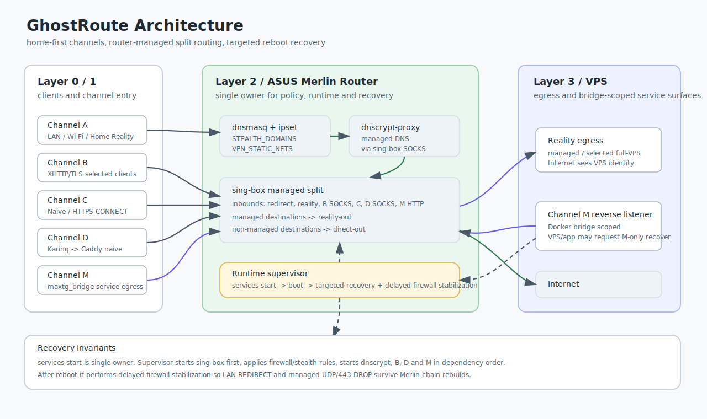

# GhostRoute

### Router-level Reality routing for ASUS Merlin: home ingress for mobile clients, Reality egress to VPS

[](LICENSE)
[](https://github.com/eiler2005/ghostroute/actions/workflows/ci.yml)
[](https://github.com/RMerl/asuswrt-merlin.ng)
[]()
[]()

**[Localized version ->](README-ru.md)**

---

## TL;DR

GhostRoute is a single-operator routing platform for an ASUS Merlin edge router.
It keeps home LAN devices app-free, gives selected remote clients a home-first
entrypoint, and sends only managed destinations through a VPS Reality/Vision
egress. The repo is intentionally module-native: routing, health, traffic,
catalog, client profiles, secrets and recovery all have separate ownership and
tests.



## Channel Status

| Channel | Status | First hop | Scope | Automatic failover |
|---|---|---|---|---|
| A | Production router data plane | Endpoint or LAN -> home router | LAN split routing, Home Reality clients, VPS Reality egress | No |
| B | Production for selected device-client profiles | Endpoint -> home router XHTTP/TLS ingress | Protocol-diverse home-first client lane, relayed through the same managed split | No |
| C | C1-Shadowrocket live compatibility plus C1-sing-box native Naive design | Endpoint -> home router HTTPS CONNECT or Naive ingress | Home-first selected-client lane; C1-SR is iPhone-proven, C1-sing-box is server-ready but blocked by SFI 1.11.4 | No |
| WireGuard | Cold fallback only | Manual emergency script | Catastrophic Reality outage recovery | No |

## Why This Exists

The project solves a narrow but real edge problem: keep ordinary home devices
configuration-free, let mobile clients enter through the home network first,
and preserve explicit routing control over which destinations use a remote VPS
exit. The design favors boring operational boundaries over broad automation:
Channel A owns the router data plane, Channel B is a separate selected-client
production lane, Channel C is the home-first Naive/compatibility lane, and none
of them silently rewrites another channel.

## Overview

GhostRoute is a layered routing setup for endpoint clients, a home ASUS Merlin
router and a remote VPS egress. Home devices can stay configuration-free, while
managed endpoint clients may also apply their own first-hop routing policy
before traffic reaches the home router.

The layered model separates the main traffic responsibilities:

- Layer 0 is endpoint/client-side routing. A client app or system VPN profile
  can decide `DIRECT` vs `MANAGED/PROXY` before traffic enters GhostRoute. For
  example, Shadowrocket on an iPhone/iPad/MacBook can use domain, IP, GEOIP and
  rule-list policy; it is a routing layer, not just a VPN toggle.
- Layer 1 is the managed channel layer. Channel A, Channel B and Channel C are
  home-first: the first network sees endpoint -> home endpoint, not endpoint ->
  VPS. See [docs/channels.md](/docs/channels.md) for the compact A/B/C handoff
  model. Channel C has C1-Shadowrocket HTTPS CONNECT compatibility for
  Shadowrocket and a C1-sing-box native Naive design that is waiting on an iOS
  client with Naive outbound support.
- Layer 2 is the home router. It terminates home-based channels and applies the
  managed split with `STEALTH_DOMAINS` / `VPN_STATIC_NETS`.
- Layer 3 is the VPS. It acts as remote egress for selected managed traffic.

Production endpoint policy is intentionally country-neutral in this repository:
local/private/captive and trusted domestic destinations go `DIRECT`; non-local,
foreign, unknown or selected destinations go `MANAGED/PROXY`; `FINAL` points to
`MANAGED/PROXY` in country-aware deployment profiles. The concrete country
suffixes, GEOIP lists and service lists belong to private deployment profiles,
not the general architecture.

Only Channel A is part of the automatic router data plane. Channel B is
production for selected device-client profiles, has its own ingress/relay
surface and must stay isolated from Channel A REDIRECT ownership. Channel C is
home-first, separate from Channel A/B routing and has no automatic failover.

Legacy WireGuard (`wgs1` + `wgc1`) is decommissioned in normal operation.
`wgc1_*` NVRAM remains only as a cold fallback.

If the router reports WAN `carrier=0` or "network cable unplugged", that is a
physical/provider WAN-link incident. It is not evidence that Channel A,
Caddy/VPS, or the Reality/Vision data plane is broken.

---

## Key Features

- Domain-based routing with `dnsmasq` + `ipset`.
- Single active domain catalog for home LAN (`STEALTH_DOMAINS`).
- Shared static CIDR catalog for direct-IP services via `VPN_STATIC_NETS`.
- Optional Layer 0 endpoint/client-side routing for devices that support
  rule-based client profiles such as Shadowrocket-style configs.
- Channel A VLESS+Reality+Vision egress through a VPS host behind shared Caddy L4 on TCP/443.
- Channel B selected-client production home-first lane: selected devices connect
  to the home router first via XHTTP/TLS, then the router relays into local
  sing-box SOCKS and reuses the Reality/Vision upstream to VPS `:443`.
- Channel C home-first lane: C1-Shadowrocket uses authenticated HTTPS
  CONNECT/TLS for Shadowrocket compatibility and is live-proven. C1-sing-box
  uses sing-box Naive on the home endpoint as the native design, but current
  SFI `1.11.4` rejects outbound `type: naive`. Both router-side paths apply the
  same managed split and Reality/Vision upstream.
- Router-side VLESS+Reality ingress on TCP/<home-reality-port> for remote clients,
  so the first network sees the home endpoint instead of the VPS endpoint.
- Stable router-side `sing-box` TCP REDIRECT instead of unstable Merlin TUN routing.
- Automatic domain discovery that writes `STEALTH_DOMAINS` only.
- Local QR/VLESS profile generation from Ansible Vault.
- Health, traffic and catalog reports suitable for humans and LLM handoff.
- Local GhostRoute health monitor with router-side `STATUS_OK` / `STATUS_FAIL`,
  `summary-latest.md`, and internal alert ledgers on router storage.

---

## Operational Modules

GhostRoute is organized as a small operational platform around the routing
core, not just a set of firewall scripts:

- **Routing Core** — the production data plane: dnsmasq/ipset classification,
  sing-box REDIRECT and home Reality ingress, managed Reality egress to VPS,
  direct-out fallback for non-managed traffic, and WireGuard cold fallback.
- **GhostRoute Health Monitor** — a read-only reliability module for the
  router + VPS setup. It produces local `STATUS_OK` / `STATUS_FAIL` sentinels,
  `status.json`, Markdown summaries, daily digests and disk-based alert
  ledgers without changing production routing state.
- **Traffic Observatory** — usage and routing reports for WAN, LAN/Wi-Fi,
  Home Reality QR clients, popular destinations and split-routing mistakes.
  It is designed for day-to-day inspection and safe LLM handoff with redacted
  device labels by default.
- **DNS & Catalog Intelligence** — DNS lookup observation, domain discovery
  and managed-catalog maintenance. It helps identify which domains a service
  uses, keeps manual and auto-discovered rules separated, and feeds
  `STEALTH_DOMAINS` / `VPN_STATIC_NETS` without requiring VPN apps on home
  devices.
- **Routing Policy Principles** — the compact contract for endpoint policy,
  channel ingress, router managed split and VPS/home egress decisions. See
  [docs/routing-policy-principles.md](/docs/routing-policy-principles.md).
- **DNS Policy** — channel proof guidance for DNS leak vs resolver fingerprint:
  the primary goal is no DNS leakage to the mobile operator; resolver geography
  shown by BrowserLeaks is a secondary consistency signal. See
  [docs/dns-policy.md](/docs/dns-policy.md).
- **Performance Diagnostics Toolkit** — checks and documentation for latency,
  retransmits, TCP tuning, MSS clamp, keepalive behavior and LTE/Home Reality
  performance symptoms, so speed issues can be diagnosed separately from
  routing correctness.
- **SNI Rotation Guide for Reality** - operational guidance for validating,
  rotating and documenting Reality cover SNI choices, including client behavior,
  regional reachability and rollback considerations.
- **Client Profile Factory** — local generation and cleanup of QR/VLESS
  profiles from Ansible Vault, including separate router, home-mobile,
  emergency, Channel B and Channel C artifact flows. Generated credentials stay
  outside git.
- **Secrets Management** — Ansible Vault templates, local secret storage rules,
  generated-artifact isolation and a repo-specific `secret-scan` for catching
  real URIs, UUIDs, keys, public endpoints and production literals before push.
- **Recovery & Verification Toolkit** — `verify.sh`, Ansible verification,
  incident runbooks and explicit cold-fallback scripts for controlled manual
  recovery when Reality, VPS, DNS or routing invariants drift.

Together these modules make the repo auditable: routing, health, traffic,
performance and recovery procedures are documented as separate operational
surfaces with clear read-only diagnostics and explicit manual recovery steps.
See the full module map in
[docs/operational-modules.md](/docs/operational-modules.md).
For a compact channel handoff, see [docs/channels.md](/docs/channels.md).

---

## Architecture At A Glance

```text
                         Control machine
                deploy.sh / Ansible / reports / vault
                              |
                              v
Layer 0 endpoint/client routing
  local/private/captive/trusted domestic -> DIRECT
  foreign/non-local/unknown/selected     -> MANAGED/PROXY
  FINAL                                  -> MANAGED/PROXY
                  |
                  v
Layer 1 managed channels
  Channel A -> endpoint -> home endpoint :<home-reality-port>
            -> ASUS sing-box Reality inbound
  Channel B -> endpoint -> VLESS+XHTTP+TLS -> home endpoint :<home-channel-b-port>
            -> router local Xray XHTTP/TLS ingress
  Channel C -> endpoint -> Naive/HTTPS-H2-CONNECT-like
            -> home endpoint :<home-channel-c-public-port>
            -> router sing-box Naive ingress
                  |
                  v
Layer 2 home router
  Home Wi-Fi/LAN DNS -> dnsmasq + ipset
                              |
                              +-- managed match
                              |     STEALTH_DOMAINS / VPN_STATIC_NETS
                              |     -> sing-box REDIRECT / reality-in
                              |     -> VLESS+Reality outbound
                              |     -> Layer 3 VPS Caddy L4 -> Xray -> Internet
                              |
                              +-- non-managed match
                                    -> direct-out -> home WAN -> Internet

Layer 3 VPS
  remote egress for selected managed traffic
  sites see VPS IP for managed traffic

Operational layer:
  Routing Core        -> dnsmasq/ipset/sing-box/Reality split
  Health Monitor      -> STATUS_OK/FAIL, summaries, local alerts
  Traffic Observatory -> WAN/LAN/Home Reality usage and routing checks
  DNS Intelligence    -> lookup evidence, domain discovery, catalog review
  Performance Toolkit -> RTT/retransmit/TCP/MSS diagnostics
  SNI Rotation Guide  -> Reality cover validation, rotation, rollback
  Client Profiles     -> QR/VLESS, selected-client B/C artifacts from Vault
  Secrets Management  -> vault, generated artifacts, secret-scan
  Recovery Toolkit    -> verify.sh, Ansible verify, runbooks, cold fallback
```

---

## How It Works

### 1. Home Wi-Fi / LAN Devices

```text
Home Wi-Fi / LAN devices
      |
      +-- DNS query
      |     |
      |     v
      |  dnsmasq
      |  +-- managed domain -> STEALTH_DOMAINS
      |  +-- static network -> VPN_STATIC_NETS
      |  +-- other domain   -> normal DNS path
      |
      +-- TCP connection to matched IP
            |
            v
      ASUS Router / Merlin
      +-- nat REDIRECT :<lan-redirect-port>
      +-- sing-box redirect inbound
      +-- VLESS+Reality TCP/443
            |
            v
      VPS host
      +-- shared Caddy :443
      +-- Xray Reality inbound
            |
            v
      Internet
```

Home devices do not need VPN apps. The router sees DNS answers, fills `STEALTH_DOMAINS`, redirects matching TCP traffic into sing-box, and sends it through Reality. UDP/443 for managed destinations is silently dropped so apps fall back from QUIC to TCP.

### 2. Endpoint / Client-Side Routing

```text
Endpoint device
  -> optional client-side rules
       local/private/captive/trusted domestic -> DIRECT
       foreign/non-local/unknown/selected     -> MANAGED/PROXY
       FINAL                                  -> MANAGED/PROXY
  -> selected managed channel
```

Layer 0 can exist on any endpoint that supports rule-based routing. Shadowrocket
on iPhone/iPad/MacBook is the primary example today: a config file can choose
`DIRECT` or `PROXY/MANAGED` by domain, IP, GEOIP or rule list before traffic
reaches Channel A/B/C. Devices without Layer 0 policy can still rely on the
router-managed split at Layer 2.

### 3. Remote QR / VLESS Clients

```text
Endpoint outside home
      |
      v
Client app imports generated QR profile
      |
      v
Home public IP :<home-reality-port>
      |
      v
ASUS Router / Merlin
+-- sing-box home Reality inbound
+-- managed destination
|     +-- STEALTH_DOMAINS / VPN_STATIC_NETS
|     +-- sing-box Reality outbound
|     +-- VPS host / Caddy / Xray
|     +-- Internet
+-- non-managed destination
      +-- sing-box direct outbound
      +-- home WAN
      +-- Internet
```

For Channel A/B managed traffic, the first network sees the endpoint connecting
to the home endpoint, not directly to the VPS. The home ISP sees the home router
connecting to the VPS tunnel. Managed websites/checkers see the VPS exit IP;
non-managed websites see the home WAN IP.

Detailed workflow, ports, components and observer model:
[modules/routing-core/docs/network-flow-and-observer-model.md](/modules/routing-core/docs/network-flow-and-observer-model.md).

### 4. Cold Fallback

WireGuard is not active in steady state. The preserved `wgc1_*` NVRAM can be used only with `modules/recovery-verification/router/emergency-enable-wgc1.sh` during a catastrophic Reality outage.

### 5. Channel B/C Device Profiles

Channel B and Channel C are device-client lanes with different client surfaces:

- Channel B is production for selected device-client profiles. It is
  home-first: selected devices connect to dedicated home ingress on
  `:<home-channel-b-port>`. A local Xray process terminates that first hop and
  forwards traffic into local sing-box SOCKS, so the second hop reuses the same
  existing Reality/Vision upstream to VPS as Channel A.
- Channel C is the home-first Naive/compatibility lane. C1-sing-box is the
  router-side native Naive design, but the tested iPhone SFI app used sing-box
  `1.11.4` and rejected outbound `type: naive`; generated SFI native profiles
  are disabled by default until the selected iPhone client supports Naive
  outbound. C1-Shadowrocket devices use HTTPS CONNECT/TLS and terminate at
  `channel-c-shadowrocket-http-in`. Both router-side paths apply the same
  managed split as the other home-first lanes.

Channel B isolation boundaries are strict: it has its own ingress port and
local Xray relay process, but it does not mutate Channel A REDIRECT ownership,
router DNS, TUN state or automatic failover. Treat generated
`ansible/out/clients-channel-b/` artifacts as selected-client production
credentials and generated `ansible/out/clients-channel-c/` artifacts as
selected-client Channel C artifacts. Shadowrocket compatibility is not proof of
native Naive; see [docs/channels.md](/docs/channels.md) and
[docs/channel-c.md](/docs/channel-c.md).

---

## Technical Stack

```text
Router:
  ASUS RT-AX88U Pro + Asuswrt-Merlin
  dnsmasq + ipset + iptables
  sing-box REDIRECT inbound on :<lan-redirect-port>
  sing-box home Reality inbound on :<home-reality-port>
  optional Channel B home XHTTP/TLS ingress on :<home-channel-b-port>
  optional Channel B local Xray relay to sing-box SOCKS on 127.0.0.1:<router-socks-port>
  optional Channel C1 Naive ingress on :<home-channel-c-ingress-port>
  policy DNS split via dnsmasq + sing-box vps-dns-in
  Legacy WireGuard disabled; wgc1 NVRAM preserved for cold fallback

VPS:
  VPS Ubuntu host
  shared system Caddy with layer4 plugin on :443
  existing 3x-ui/Xray Docker container behind Caddy
  Xray/3x-ui Reality inbound on 127.0.0.1:<xray-local-port>
  Unbound managed-DNS resolver on restricted :15353 listeners:
    - 127.0.0.1 for host checks
    - Docker bridge / configured Reality target for Xray-routed DNS
    - UFW allows :15353 only from the Xray Docker bridge
  optional direct-mode Channel B Xray XHTTP on 127.0.0.1:<xhttp-local-port>
  stealth stack under /opt/stealth

Control:
  deploy.sh for router base runtime files/catalogs
  Ansible for VPS, router stealth layer, verification and QR generation
  ansible-vault for real credentials and client parameters
```

---

## Project Structure

```text
configs/
  dnsmasq-stealth.conf.add        # STEALTH_DOMAINS for home LAN Channel A
  static-networks.txt             # shared CIDR catalog

ansible/
  README.md                       # Ansible control plane overview
  playbooks/10-stealth-vps.yml
  playbooks/11-channel-b-vps.yml
  playbooks/20-stealth-router.yml
  playbooks/21-channel-b-router.yml
  playbooks/22-channel-c-router.yml
  playbooks/30-generate-client-profiles.yml
  playbooks/99-verify.yml
  secrets/stealth.yml             # ansible-vault, gitignored
  out/clients/                    # generated QR/profile artifacts, gitignored
  out/clients-home/               # generated home QR/profile artifacts, gitignored
  out/clients-emergency/          # generated emergency artifacts, gitignored
  out/clients-channel-b/          # generated Channel B artifacts, gitignored
  out/clients-channel-c/          # generated Channel C artifacts, gitignored

modules/
  routing-core/
  ghostroute-health-monitor/
  traffic-observatory/
  dns-catalog-intelligence/
  performance-diagnostics/
  reality-sni-rotation/
  client-profile-factory/
  secrets-management/
  recovery-verification/

scripts/
  README.md                       # reserved for future cross-repo utilities

docs/
  architecture.md
  operational-modules.md
  getting-started.md
  troubleshooting.md
  future-improvements-backlog.md
```

The detailed physical module map lives in
[docs/operational-modules.md](/docs/operational-modules.md). The global README
keeps the high-level workflow; module folders contain local implementation
overviews. The Ansible router/VPS deployment component map lives in
[ansible/README.md](/ansible/README.md).

---

## Quick Start

```bash
# Base router deploy: dnsmasq, firewall-start, nat-start, cron scripts
ROUTER=192.168.50.1 ./deploy.sh

# Channel A router layer: sing-box, dnscrypt-proxy, reboot-safe REDIRECT routing
cd ansible
ansible-playbook playbooks/20-stealth-router.yml

# Channel B selected-client home-first add-on on router
ansible-playbook playbooks/21-channel-b-router.yml

# Optional direct mode for B
ansible-playbook playbooks/11-channel-b-vps.yml

# Channel C1 selected-client home-first add-on on router
ansible-playbook playbooks/22-channel-c-router.yml

# End-to-end verification: VPS + router
ansible-playbook playbooks/99-verify.yml
cd ..

# Local health snapshot
./verify.sh
./modules/ghostroute-health-monitor/bin/router-health-report
```

`20-stealth-router.yml` also installs the Channel A reboot hooks and catalog
scripts (`firewall-start`, `cron-save-ipset`, `domain-auto-add.sh`,
`update-blocked-list.sh`) so REDIRECT and the accumulated `STEALTH_DOMAINS`
state survive router reboots and Merlin firewall rebuilds.

`21-channel-b-router.yml` is the Channel B add-on: dedicated home XHTTP ingress
plus local router relay into sing-box Reality upstream, without taking over Channel A
REDIRECT routing.

Traffic and observability:

```bash
# Main usage report: exits, devices, Home Reality ingress clients,
# popular destinations and routing mistake checks.
./modules/traffic-observatory/bin/traffic-report today
./modules/traffic-observatory/bin/traffic-report yesterday
./modules/traffic-observatory/bin/traffic-report week
./modules/traffic-observatory/bin/traffic-report month

# Human/LLM-safe operational snapshot.
./modules/ghostroute-health-monitor/bin/router-health-report
```

The traffic report answers how much went through the VPS, how much
stayed on the home WAN, which devices and Home Reality ingress clients
were active, and whether likely routing mistakes appeared. See
[modules/traffic-observatory/docs/traffic-observability.md](/modules/traffic-observatory/docs/traffic-observability.md).

Health monitor:

```bash
# Install/update with deploy.sh or ansible, then run a local router-side sample.
ssh admin@192.168.50.1 '/jffs/scripts/health-monitor/run-once'

# Primary storage on the router:
ssh admin@192.168.50.1 'cat /opt/var/log/router_configuration/health-monitor/summary-latest.md'
ssh admin@192.168.50.1 'cat /opt/var/log/router_configuration/health-monitor/alerts/$(date +%F).md'
ssh admin@192.168.50.1 'cat /opt/var/log/router_configuration/health-monitor/status.json'

# Unified router+VPS report from the control machine.
./modules/ghostroute-health-monitor/bin/ghostroute-health-report
./modules/ghostroute-health-monitor/bin/ghostroute-health-report --save
```

The health monitor is read-only for production routing state. It writes local
internal alerts and reports to router storage only. Primary path:
`/opt/var/log/router_configuration/health-monitor`; fallback:
`/jffs/addons/router_configuration/health-monitor`.
Scheduled collection runs hourly; use `/jffs/scripts/health-monitor/run-once`
for an immediate fresh snapshot.
The VPS observer keeps its own local-only status on the VPS under
`/var/log/ghostroute/health-monitor`. `ghostroute-health-report --save` stores
merged latest/history reports on the router under `health-monitor/global/` and
keeps 31 days of history.

How to read a router-side alert:

1. Check `STATUS_OK` / `STATUS_FAIL`.
2. Read `summary-latest.md`.
3. Read `alerts/<today>.md`.
4. Use `raw/<today>.jsonl` only for exact evidence.
5. After manual recovery, run `run-once` or wait for the next hourly cycle and
   confirm `STATUS_OK`; do not delete alert history.

Expected invariants:

- LAN TCP for `STEALTH_DOMAINS` and `VPN_STATIC_NETS` is redirected to `:<lan-redirect-port>`.
- LAN UDP/443 for those sets is silently dropped to force TCP fallback.
- Remote QR/VLESS clients connect to the home public IP on `:<home-reality-port>`, not directly to VPS.
- Router-side `sing-box` accepts `reality-in` on `0.0.0.0:<home-reality-port>`.
- Mobile managed destinations route to `reality-out`; mobile non-managed destinations route to `direct-out`.
- Plain DNS from Wi-Fi/LAN and mobile Channels A/B/C reaches router dnsmasq.
- Managed/foreign DNS goes through `dnsmasq -> vps-dns-in -> hijack-dns ->
  vps-dns-server -> reality-out -> VPS Unbound`; RU/direct/default DNS stays on
  the home/RF/default resolver path.
- VPS Unbound `:15353` is not public: UFW allows it only from the Xray Docker
  bridge, while public `53/tcp,udp` is denied.
- `STEALTH_DOMAINS` and `VPN_STATIC_NETS` exist.
- `VPN_DOMAINS`, `RC_VPN_ROUTE`, `0x1000`, active `wgs1` and active `wgc1` are absent.

---

## Client QR Profiles

Client profiles are generated locally from Ansible Vault:

```bash
./modules/client-profile-factory/bin/client-profiles generate
./modules/client-profile-factory/bin/client-profiles open
```

Generated files live under `ansible/out/clients/`, including `iphone-*.png`, `macbook.png`, matching `.conf` files and a local `qr-index.html` gallery.

The `router.conf` profile still targets the VPS directly because it is the router's outbound identity. `iphone-*` and `macbook` profiles target the home public IP first.

Never commit or paste real VLESS URIs, UUIDs, Reality keys, short IDs, admin paths or QR payloads into documentation. Use fake placeholders only.

See [modules/client-profile-factory/docs/client-profiles.md](/modules/client-profile-factory/docs/client-profiles.md) and [modules/secrets-management/docs/secrets-management.md](/modules/secrets-management/docs/secrets-management.md).

---

## Demo

The repo-only checks do not require router access, Vault access or generated
client artifacts:

```bash
$ ./modules/secrets-management/bin/secret-scan
secret-scan: ok

$ ./tests/run-all.sh
router-health fixture smoke tests passed
catalog-review fixture smoke tests passed
dns-forensics fixture smoke tests passed
health-monitor fixture tests passed
vps-health-monitor fixture tests passed
module entrypoint tests passed
channel-a deploy static tests passed
channel-b/c static tests passed
audit-fixes tests passed
all fixture tests passed
```

When the router and VPS are reachable, the live operator flow adds read-only
verification and sanitized reports:

```bash
./verify.sh --verbose
cd ansible && ansible-playbook playbooks/99-verify.yml
cd ..
./modules/ghostroute-health-monitor/bin/router-health-report
./modules/traffic-observatory/bin/traffic-report check
./modules/traffic-observatory/bin/traffic-report today
```

Expected live evidence: Channel A router invariants are green, Channel B
selected-client traffic reaches the home ingress and uses the managed split, and
Channel C traffic reaches either `channel-c-naive-in` for C1-sing-box or
`channel-c-shadowrocket-http-in` for Shadowrocket compatibility before using the
same managed split.

Sanitized live sample from the home network:

```text
router-health-report:
  Result: OK
  Drift items: 0
  STEALTH catalog usage: 882/65536 (1.3%)
  Channel A REDIRECT listener: OK
  Home Reality listener: OK
  Home Reality managed split: OK

ansible-playbook playbooks/99-verify.yml -e verify_openclaw_checks_enabled=false:
  stealth-vps: ok=11 failed=0
  router-home: ok=41 failed=0
  Channel B home relay config: OK
  sing-box Channel B relay SOCKS inbound: OK

traffic-report today:
  Client observed total: 9.35 GiB
  Via VPS: 8.78 GiB (93.9% observed)
  Via home RU direct: 581.5 MiB (6.1% observed)
  Home Reality connections: 36817
  Home Reality unresolved: 0
  Channel B ingress: 0 B observed in this sample window
```

---

## Architecture Decisions

GhostRoute uses concise ADRs for decisions that affect routing behavior,
runtime layout, secret handling, public command structure and monitoring
contracts.

| ADR | Decision |
|---|---|
| [0001](/docs/adr/0001-module-native-repo.md) | Keep the repository module-native rather than script-bucket oriented. |
| [0002](/docs/adr/0002-scripts-reserved-policy.md) | Reserve `scripts/` for future cross-module utilities. |
| [0003](/docs/adr/0003-local-only-health-alerts.md) | Keep health alerts local and read-only by default. |
| [0004](/docs/adr/0004-deprecated-wireguard-cold-fallback.md) | Preserve WireGuard only as an explicit cold fallback. |
| [0005](/docs/adr/0005-secrets-outside-git.md) | Keep real credentials and generated artifacts outside git. |
| [0006](/docs/adr/0006-channel-terminology-and-manual-fallbacks.md) | Define initial channel terminology and no automatic B/C failover. |
| [0007](/docs/adr/0007-channel-b-production-channel-c-planned.md) | Record current B/C channel maturity. |

See [docs/adr/](/docs/adr/) for the full index and when to add a new record.

---

## Security Considerations

The public repo intentionally contains implementation logic, placeholders and
sanitized examples only. Real endpoints, listener ports, UUIDs, keys, QR
payloads, admin paths and generated profiles stay in Vault or gitignored local
directories. See [SECURITY.md](/SECURITY.md) and
[modules/secrets-management/docs/secrets-management.md](/modules/secrets-management/docs/secrets-management.md).

---

## Detailed Documentation

- [README-ru.md](README-ru.md) - localized documentation
- [SECURITY.md](/SECURITY.md) - threat model, protected assets, non-goals and recovery boundaries
- [ansible/README.md](/ansible/README.md) - deployment, Vault, profile generation and live verification control plane
- [docs/operational-modules.md](/docs/operational-modules.md) - canonical module map and operating surfaces
- [docs/archive/roadmaps/architecture-improvement-roadmap-2026-04-26.md](/docs/archive/roadmaps/architecture-improvement-roadmap-2026-04-26.md) - archived architecture/security improvement roadmap
- [docs/adr/](/docs/adr/) - concise architecture decision records
- [docs/routing-policy-principles.md](/docs/routing-policy-principles.md) - compact routing policy contract across Channels A/B/C
- [docs/architecture.md](/docs/architecture.md) - current routing architecture
- [modules/routing-core/docs/network-flow-and-observer-model.md](/modules/routing-core/docs/network-flow-and-observer-model.md) - detailed traffic flows and observer model
- [modules/traffic-observatory/docs/traffic-observability.md](/modules/traffic-observatory/docs/traffic-observability.md) - traffic reports, device/app popularity and routing mistake checks
- [modules/ghostroute-health-monitor/docs/stealth-monitoring-implementation-guide.md](/modules/ghostroute-health-monitor/docs/stealth-monitoring-implementation-guide.md) - GhostRoute health monitor implementation
- [modules/ghostroute-health-monitor/docs/stealth-monitor-runbook.md](/modules/ghostroute-health-monitor/docs/stealth-monitor-runbook.md) - health monitor alerts and recovery runbook
- [modules/performance-diagnostics/docs/routing-performance-troubleshooting.md](/modules/performance-diagnostics/docs/routing-performance-troubleshooting.md) - LTE/Home Reality performance diagnostics and fixes
- [modules/routing-core/docs/channel-routing-operations.md](/modules/routing-core/docs/channel-routing-operations.md) - day-2 operations and channel switching
- [modules/routing-core/docs/stealth-channel-implementation-guide.md](/modules/routing-core/docs/stealth-channel-implementation-guide.md) - implemented VLESS+Reality guide
- [modules/dns-catalog-intelligence/docs/domain-management.md](/modules/dns-catalog-intelligence/docs/domain-management.md) - domain and static-network catalog management
- [modules/dns-catalog-intelligence/docs/stealth-domains-curation-audit.md](/modules/dns-catalog-intelligence/docs/stealth-domains-curation-audit.md) - advisory STEALTH_DOMAINS curation review
- [modules/secrets-management/docs/secrets-management.md](/modules/secrets-management/docs/secrets-management.md) - vault, local secrets and pre-push scan
- [modules/secrets-management/docs/vault-offsite-backup.md](/modules/secrets-management/docs/vault-offsite-backup.md) - encrypted offsite Vault backup and restore drill
- [modules/client-profile-factory/docs/client-profiles.md](/modules/client-profile-factory/docs/client-profiles.md) - VLESS/Reality QR workflow
- [docs/troubleshooting.md](/docs/troubleshooting.md) - incident diagnostics

---

## License

[MIT](LICENSE) - Copyright (c) 2025 Denis Ermilov
