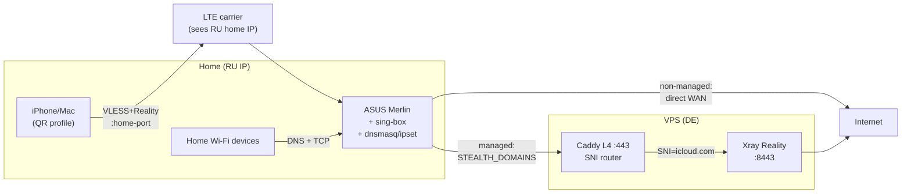

# GhostRoute Repository Review — 2026-04-28

> **Status: archived / superseded snapshot.** This review is preserved as
> historical review evidence, not as the current source of truth.
>
> Implemented after this snapshot on 2026-04-28: GitHub Actions CI,
> README top-fold Mermaid/TLDR/channel matrix/demo/ADR index, `SECURITY.md`,
> Vault offsite backup runbook, Channel B production wording with Channel C as
> the next compatibility lane, ADR 0007, live Channel A/B validation, LTE
> YouTube fix, and router performance headroom tuning. Remaining live work now
> belongs to focused ops follow-ups such as compact status, active leak checks
> and Channel C proof in its own change set.
>
> The body below intentionally keeps the original findings, including now-stale
> notes about missing CI, B/C wording, backup cleanup and older connection-limit
> assumptions, so it can be used for before/after audit.

> Архитектурный, security и presentation review репозитория `router_configuration` (GhostRoute) с точки зрения практичного SRE и инженера домашних сетей. Цель — оценить готовность для безопасного домашнего использования и презентабельность как инженерного кейса для работодателя.

---

## 1. Краткий диагноз

**Уровень зрелости:** **Good enough → Production-like (single-operator)**

Это не «home project». Архитектурный масштаб выше типичного домашнего скрипт-кладбища: модульная декомпозиция, ADR-практика, vault, read-only мониторинг с alert ledger'ами, cold fallback с явным runbook'ом. Это уже больше похоже на **junior SRE production system на одного оператора**.

### 5 главных проблем

1. **Нет CI/CD** — тесты [tests/run-all.sh](/tests/run-all.sh) существуют (8 fixture-тестов), но не запускаются автоматически. Один забытый прогон → secret-scan/syntax regression уйдёт в репо. Самый дешёвый, самый влиятельный фикс.
2. **Нет визуальных диаграмм архитектуры** — есть text-art в [README.md](/README.md) и [docs/architecture.md](/docs/architecture.md), но Mermaid/PNG отсутствует. Для работодателя это первая «упаковка», и она недоделана.
3. **Расхождение языка docs ↔ ADR** — [README.md](/README.md) английский, [docs/architecture.md](/docs/architecture.md) русский, [docs/adr/](/docs/adr/) английский, [docs/troubleshooting.md](/docs/troubleshooting.md) русский. Решение «двуязычный проект» нигде не задокументировано — выглядит как не до конца принятое.
4. **Channel B/C — half-finished** — [docs/channel-c-shadowrocket-debug-research-2026-04-27.md](/docs/channel-c-shadowrocket-debug-research-2026-04-27.md) и [docs/archive/channel-c/](/docs/archive/channel-c/) показывают работу in-flight; для внешнего читателя это «недостроенная этаж». Либо доделать, либо явно пометить как experimental в README.
5. **Бэкапы vault в репо** — [ansible/secrets/](/ansible/secrets/) содержит 3 `stealth.yml.backup-*` файла. Они gitignored (через `.gitignore` past-rule `/ansible/secrets/*.backup-*`), но создают визуальный шум при `ls`. Минор, но заметно.

### 5 самых полезных улучшений (impact / effort)

| # | Улучшение | Impact | Effort | Где |
|---|---|---|---|---|
| 1 | GitHub Actions: lint shell + ansible-lint + secret-scan + run tests/run-all.sh на каждый push | High | Low | `.github/workflows/ci.yml` (NEW) |
| 2 | Mermaid-диаграмма «5-минутная архитектура» в README.md (top fold) | High | Low | [README.md](/README.md) |
| 3 | Раздел «Demo / 5-minute walkthrough» в README.md | High | Low | [README.md](/README.md) |
| 4 | SECURITY.md + краткое threat model в репо | High (для работодателя) | Low | `SECURITY.md` (NEW) |
| 5 | Закрыть Channel B/C — либо производство, либо явный «experimental, do not use» | Medium | Medium | [README.md](/README.md), [docs/architecture.md](/docs/architecture.md) |

### Что обязательно сделать перед реальным использованием

- Если уже используется (а судя по traffic reports — да): **верификация security-инвариантов**: `./verify.sh --verbose` + `./modules/recovery-verification/bin/audit-fixes` должны быть green перед каждой mutating операцией.
- Регулярно ротировать Reality keys / SNI / UUID — ADR 0006 это упоминает, но процесс не автоматизирован.
- Backup vault offline (encrypted USB / password manager) — есть только локальные `stealth.yml.backup-*`, что fragile.

### Что можно спокойно отложить

- Полный idempotency-rewrite Ansible-ролей (deferred в [docs/archive/roadmaps/architecture-improvement-roadmap-2026-04-26.md](/docs/archive/roadmaps/architecture-improvement-roadmap-2026-04-26.md), правильное решение).
- Внешние alert-каналы (push/email) для health monitor — текущий подход «local STATUS_OK/STATUS_FAIL + ADR 0003» осознанный.
- SBOM, SOC2-стиль аудит, Galaxy-grade reusable Ansible roles — overengineering для one-person home project.

---

## 2. Архитектура

### 2.1 Что в архитектуре уже хорошо

- **Модульная декомпозиция** ([modules/](/modules/), 9 модулей + `shared/`) — реальная разделение по operational surface, не просто «папки по типу файлов». ADR 0001 фиксирует правило.
- **Один production data plane + явные manual caveats** — Channel A — единственный production, B/C — «manual lanes», ADR 0006. Это редкая зрелая архитектурная позиция: автор сопротивляется соблазну превратить exp-каналы в auto-failover.
- **Read-only мониторинг по умолчанию** (ADR 0003) — health monitor не мутирует production routing, пишет только в local `/opt/var/log/router_configuration/health-monitor`. Это правильный operational instinct.
- **Vault-first secrets discipline** (ADR 0005) — `ansible/secrets/stealth.yml` зашифрован, шаблон `stealth.yml.example`, есть [secret-scan](/modules/secrets-management/bin/secret-scan), все generated артефакты gitignored ([.gitignore](/.gitignore) lines 24-46).
- **Cold fallback, явный, с dry-run** — [modules/recovery-verification/router/emergency-enable-wgc1.sh](/modules/recovery-verification/router/emergency-enable-wgc1.sh), ADR 0004. WGC1 NVRAM сохранён намеренно, не активен в steady state.
- **Drift detection встроен в верификацию** — [verify.sh](/verify.sh) → [modules/recovery-verification/bin/verify.sh](/modules/recovery-verification/bin/verify.sh) + [modules/recovery-verification/bin/audit-fixes](/modules/recovery-verification/bin/audit-fixes). Инварианты в [docs/architecture.md](/docs/architecture.md):252-262 явно перечислены.
- **Boot-safe** — `firewall-start` + `cron-save-ipset` + `stealth-route-init.sh`, документировано в [docs/architecture.md](/docs/architecture.md):204-218. Reboot не ломает routing.
- **Два внутренних пути для DNS не leak'ают** — `dnscrypt-proxy` на 127.0.0.1:port → SOCKS через sing-box → upstream. Filter-AAAA при IPv6 OFF.

### 2.2 Что является настоящим риском

| Риск | Где | Mitigation сейчас | Что не покрыто |
|---|---|---|---|
| Reality outage без cold fallback вручную | [modules/recovery-verification/router/emergency-enable-wgc1.sh](/modules/recovery-verification/router/emergency-enable-wgc1.sh) | Скрипт есть, dry-run есть | Нет automated detection «Reality down 30 min → ping operator» |
| Vault loss / corruption | [ansible/secrets/stealth.yml](/ansible/secrets/stealth.yml) | Локальные `*.backup-*` | Нет offsite/encrypted-USB backup policy документированной |
| Ansible role contracts слабые | [ansible/roles/](/ansible/roles/) | Часть ролей имеет `defaults/main.yml`/`meta/main.yml` (P1 в roadmap) | Не все роли — runtime ассумпции скрыты |
| Single VPS — single point of failure | [ansible/group_vars/vps_stealth.yml](/ansible/group_vars/vps_stealth.yml) | Cold fallback на legacy WG | Нет multi-VPS / load balancing |
| Hardcoded paths в shell-скриптах | [deploy.sh](/deploy.sh), router scripts | Roadmap §P1: «Start extracting hardcoded paths only in later targeted role refactors» | Аккуратно отложено, осознанно |

### 2.3 Что можно не трогать сейчас

- Channel A REDIRECT-architecture (sing-box на роутере, NAT REDIRECT, ipset-based dispatch) — стабильно, проверено.
- Reality + Vision + iCloud SNI — SOTA для anti-DPI, ротация документирована в [modules/reality-sni-rotation/](/modules/reality-sni-rotation/).
- dnsmasq + ipset как DNS-classifier — простое, надёжное, не хайповое.
- 6 ADR — короткие, нужны, не разрослись.

### 2.4 Минимальная целевая архитектура

Текущая архитектура **уже минимальная целевая.** Добавлять не нужно — нужно зафиксировать и отполировать:

Так выглядит архитектура **сейчас**, и она правильная. Добавить только визуализацию — не менять структуру.

### 2.5 Spaghetti config check

Не нашёл. Конфиги распределены логично:

- [configs/dnsmasq-stealth.conf.add](/configs/dnsmasq-stealth.conf.add) — managed domains
- [configs/static-networks.txt](/configs/static-networks.txt) — managed CIDRs
- [configs/domains-no-vpn.txt](/configs/domains-no-vpn.txt) — exceptions
- [ansible/group_vars/](/ansible/group_vars/) — non-secret defaults
- [ansible/secrets/stealth.yml](/ansible/secrets/stealth.yml) — vault

Есть один потенциальный smell: backup-копии vault в [ansible/secrets/](/ansible/secrets/) (3 шт.). Они gitignored, но stale-копии в working tree — operational drift. Хорошо бы script для авто-cleanup старше N дней.

---

## 3. Документация в git

| Раздел | Есть? | Достаточно для домашнего проекта? | Что улучшить | Приоритет |
|---|---|---|---|---|
| README | ✅ ([README.md](/README.md), 476 строк) | Да, очень подробно | Добавить Mermaid-диаграмму в top fold; добавить Demo секцию | High |
| Quick start | ✅ ([docs/getting-started.md](/docs/getting-started.md), 240 строк) | Да | Добавить «happy path: 5 minutes from clone to first traffic via Reality» | Medium |
| Install / setup | ✅ ([ansible/README.md](/ansible/README.md), [docs/getting-started.md](/docs/getting-started.md)) | Да | — | — |
| Описание конфигов | ✅ (распределено по module docs + [configs/](/configs/) + ansible defaults) | Да, но рассыпано | Один сводный «Config reference» был бы полезен | Low |
| Примеры iPhone/Mac/роутер/VPS | ✅ ([modules/client-profile-factory/docs/client-profiles.md](/modules/client-profile-factory/docs/client-profiles.md), [docs/getting-started.md](/docs/getting-started.md)) | Да | — | — |
| Troubleshooting | ✅ ([docs/troubleshooting.md](/docs/troubleshooting.md), 308 строк, 9 разделов сценариев) | **Очень сильно** — лучше чем у большинства home-проектов | — | — |
| Описание DNS и маршрутизации | ✅ ([docs/architecture.md](/docs/architecture.md):137-202, [modules/routing-core/docs/](/modules/routing-core/docs/)) | Да | — | — |
| Раздел безопасности | ⚠️ (рассыпано: [modules/secrets-management/](/modules/secrets-management/), ADR 0005, README mention secret-scan) | Нет одного места | Создать `SECURITY.md` в корне | High |
| Раздел восстановления | ✅ ([modules/recovery-verification/docs/failure-modes.md](/modules/recovery-verification/docs/failure-modes.md), [docs/troubleshooting.md](/docs/troubleshooting.md), [modules/ghostroute-health-monitor/docs/stealth-monitor-runbook.md](/modules/ghostroute-health-monitor/docs/stealth-monitor-runbook.md)) | Да | — | — |
| ADR | ✅ ([docs/adr/](/docs/adr/), 6 ADR + README с правилами) | Да, очень редко в home-projects встречается | Можно добавить ещё 1-2 для Channel terminology, SNI rotation | Low |
| Roadmap / backlog | ✅ ([docs/future-improvements-backlog.md](/docs/future-improvements-backlog.md) 386 строк, [docs/archive/roadmaps/](/docs/archive/roadmaps/)) | Да, очень структурно | — | — |
| Module READMEs | ✅ (9 модулей × README + docs/) | Да | — | — |
| Architecture | ✅ ([docs/architecture.md](/docs/architecture.md), 263 строки) | Да | + Mermaid | Medium |

### Главный критерий: «через 1-2 месяца сам пойму?»

**Да, с высокой вероятностью.** Causal chain в [docs/architecture.md](/docs/architecture.md), runbook в [docs/troubleshooting.md](/docs/troubleshooting.md), recovery — explicit. 6 ADR фиксируют «почему так» — это самое ценное для будущего себя.

**Слабые места для re-onboarding:**

- Channel B vs C — нужно открыть архив research'а, чтобы вспомнить состояние.
- Точные ports/UUID в `secrets/` — без Vault-доступа re-onboarding невозможен. Нужен runbook «как восстановить vault если потерял password».

---

## 4. Устойчивость к DPI / фильтрации / сетевым ограничениям

### 4.1 Risk assessment

| Область | Риск | Симптом | Как легально диагностировать | Минимальное улучшение | Приоритет |
|---|---|---|---|---|---|
| DNS leak | Низкий | DNS уходит к LTE-оператору | `dig @192.168.50.1 youtube.com` vs `dig @8.8.8.8 youtube.com`, сравнить, проверить sing-box log на SOCKS-traffic от dnscrypt | Уже OK через DoH+SOCKS+Reality | — |
| IPv6 leak | Низкий → Medium | AAAA-резолв уходит к оператору | `dig AAAA youtube.com @192.168.50.1` (должен быть пустой) | `filter-AAAA` уже включён, есть verify-проверка | — |
| WebRTC leak | На клиенте, не на роутере | Browser STUN запросы | `https://browserleaks.com/webrtc` через iPhone profile | Это вне scope роутера; добавить caveat в [modules/client-profile-factory/docs/client-profiles.md](/modules/client-profile-factory/docs/client-profiles.md) | Medium |
| SNI fingerprint | Низкий | DPI matches Reality SNI | tcpdump → Wireshark, посмотреть Client Hello SNI | `gateway.icloud.com` — strong cover, ротация документирована в [modules/reality-sni-rotation/docs/sni-rotation-candidates.md](/modules/reality-sni-rotation/docs/sni-rotation-candidates.md) | — |
| Protocol fingerprint | Низкий | Reality detection (TLS-fingerprint mismatch с реальным iCloud) | YouTube stream + iperf3 timing analysis | Vision flow + xtls-rprx-vision корректно скрывают TLS overhead | — |
| Endpoint blocking | Medium | VPS IP заблокирован Hetzner-side или на пути | curl ifconfig.me с iPhone (через VPN), сравнить с прямым | Есть emergency direct-VPS profile (отдельный от home QR) | — |
| DPI interference (RST, throttle) | Medium | Reality handshake fails / TCP RST после установления | tcpdump на роутере + VPS, искать TCP RST | Нет detection automation; добавить в health-monitor | Medium |
| LTE стабильность | Low → Medium | Mobile traffic не идёт через домашний роутер | speedtest через `iphone-1` profile + traffic-report check | Документирован MSS clamp 1360, connlimit 300, [modules/performance-diagnostics/docs/routing-performance-troubleshooting.md](/modules/performance-diagnostics/docs/routing-performance-troubleshooting.md) | — |
| Смена оператора | Low | Билинг как international | LTE-оператор видит home IP destination → domestic | Архитектурно гарантировано Reality home ingress | — |
| Split routing correctness | Low | RU сайты видят DE IP | traffic-report rule mistake checks | Уже есть [modules/traffic-observatory/](/modules/traffic-observatory/) checks | — |
| Fail-closed vs fail-open | **Medium** | При Reality outage clients идут direct WAN (managed → fail open) | Manual test: power-off VPS, проверить что managed traffic не идёт | **Документировано: fail-open для managed.** Нет explicit kill-switch | High |
| Catalog maxelem overflow | Low | STEALTH_DOMAINS заполнен → новые managed домены не попадают | `ipset list STEALTH_DOMAINS` headroom | Уже есть Growth Trends в health-report | — |

### 4.2 Must-have проверки (которые нельзя пропускать)

1. **Перед каждым релизом:** `./verify.sh --verbose && cd ansible && ansible-playbook playbooks/99-verify.yml --limit routers,vps_stealth` — должно быть green.
2. **После router reboot:** `ipset list STEALTH_DOMAINS` headroom check.
3. **При смене SNI:** [modules/reality-sni-rotation/docs/sni-rotation-candidates.md](/modules/reality-sni-rotation/docs/sni-rotation-candidates.md) protocol — `validate-sni-candidate.sh`.
4. **Перед поездкой / important demo:** speedtest через iphone-N profile, traffic-report для smoke check.

### 4.3 Что реально повышает устойчивость

- Reality + Vision + grandparent SNI (`gateway.icloud.com`) — single biggest factor.
- Home-first ingress для mobile — единственное что даёт LTE-domestic billing.
- UDP/443 DROP (silent) для managed — заставляет QUIC fallback на TCP без RST signature.
- Multi-channel (даже manual B/C) — диверсификация на случай если Reality DPI'нется.

### 4.4 Что выглядит красиво, но даёт мало пользы

- Channel C HTTPS-proxy — много вариантов конфигов (positional, keyword, fields, sing-box JSON, naive URL...) — пока ни один не подтверждён working на iPhone. Эффект на устойчивость = 0 пока не закрыт debug research.
- Tinyproxy backend для Channel C — был, потом stunnel_squid; обе альтернативы не дают преимущества над sing-box naive inbound.

### 4.5 Ложное чувство безопасности — что нельзя считать гарантией

| Что | Почему не гарантия |
|---|---|
| `./verify.sh` green | Это **invariants check**, не security audit. RKN может start blocking gateway.icloud.com SNI завтра, и `verify.sh` будет green до тех пор пока сам Reality handshake не упадёт. |
| Channel A работает | Не значит что Channel B/C работают. Они отдельные. |
| Mobile показывает «Connected» в Shadowrocket | Не значит что трафик действительно проходит через Reality. См. Channel C debug research. |
| iCloud SNI cover | RKN/DPI **может** в будущем DPI'ить TLS handshake fingerprint, не SNI. Reality handshake устойчив, но не bulletproof. |
| Health monitor «STATUS_OK» | Это **router-side** check. Не подтверждает что сторонний сайт реально получает VPS IP. |

---

## 5. Минимальная observability

### 5.1 Что уже есть

| Вопрос | Ответ — есть | Где |
|---|---|---|
| Какой сейчас внешний IP? | ✅ Через traffic-report или ручной curl ifconfig.me | [modules/traffic-observatory/bin/traffic-report](/modules/traffic-observatory/bin/traffic-report) |
| Какой DNS используется? | ✅ Через router-health-report | [modules/ghostroute-health-monitor/bin/router-health-report](/modules/ghostroute-health-monitor/bin/router-health-report) |
| Активен ли VPN/proxy? | ✅ STATUS_OK / STATUS_FAIL | router `/opt/var/log/router_configuration/health-monitor/status.json` |
| Какой маршрут выбран? | ✅ traffic-report показывает per-device, per-domain | [modules/traffic-observatory/](/modules/traffic-observatory/) |
| Packet loss / latency? | ⚠️ Частично — нет regular timing benchmarks | [modules/performance-diagnostics/](/modules/performance-diagnostics/) — manual diagnostics |
| Когда был последний reconnect? | ⚠️ Только в sing-box log, не aggregate'ится | — |
| Куда ушёл конкретный тип трафика? | ✅ traffic-report «Top by Reality / Top by Direct WAN» | [modules/traffic-observatory/docs/traffic-observability.md](/modules/traffic-observatory/docs/traffic-observability.md) |
| Была ли утечка DNS/IP? | ⚠️ Health-report показывает invariants, но нет explicit «leak check probe» | — |

### 5.2 Что добавить (легко, по убыванию impact)

1. **DNS leak probe в health-monitor.** Проверка: `dig @upstream-RU-DNS canary.host` vs `dig @router-dnscrypt canary.host`. Если router возвращает то же — leak. ~30 строк скрипта.
2. **Last-reconnect aggregator.** Парсить sing-box log на `outbound restart`/`connection reset to vps` события, выводить «last 5 reconnects» в `router-health-report`.
3. **External-IP probe.** Опционально: cron на роутере `curl --proxy socks5h://localhost:port https://ifconfig.me` → лог. Caveat: сам факт probe виден стороннему observer'у. Запускать редко (раз в час max).
4. **Compact CLI status** — `./modules/ghostroute-health-monitor/bin/status` (новый) — 5-строчный вывод: VPN status / current SNI / managed domain count / last reconnect / DNS source.
5. **Simple status page** (опционально, на `127.0.0.1:9999` через busybox httpd) — для iOS Shortcut self-check. Уже упоминается в [modules/ghostroute-health-monitor/docs/](/modules/ghostroute-health-monitor/docs/).

### 5.3 Чего не нужно делать (overengineering)

- Prometheus / Grafana — слишком тяжело для one-person home.
- Loki / Promtail для логов — то же.
- ELK — то же.
- External alerting через PagerDuty — overkill (ADR 0003 правильно отверг).

---

## 6. Фильтр полезности

| Рекомендация | Impact | Effort | Risk reduction | Нужно сейчас? | Почему |
|---|---|---|---|---|---|
| GitHub Actions CI (lint + tests) | High | Low | Medium | **Yes** | Защищает от regressions; для работодателя — visible signal of engineering discipline |
| Mermaid в README + 5-min walkthrough | High | Low | Low | **Yes** | Главное commercial polish; стоит часов 2 |
| SECURITY.md (threat model + secrets policy + RKN scope) | High | Low | Medium | **Yes** | Демонстрирует security thinking; работодатель ищет именно это |
| Закрыть Channel C debug или явно пометить experimental | Medium | Medium | Low | **Yes** | Текущее состояние — «есть какой-то in-flight research», некрасиво |
| DNS leak probe в health-monitor | Medium | Low | Medium | Yes | Закрывает один из real risks |
| Last-reconnect aggregator | Medium | Low | Low | Later | Удобство, не critical |
| Vault offsite backup runbook | Medium | Low | High | Yes | Single point of failure |
| Multi-VPS / failover | Medium | High | High | Later | Большая работа, но даёт реальный uptime gain |
| ADR для Channel terminology (если ещё нет полного) | Low | Low | Low | Later | ADR 0006 уже есть; можно расширить |
| CHANGELOG.md | Low | Low | Low | Later | Полезно для employer demo, не critical |
| CONTRIBUTING.md | Low | Low | None | No | One-person project, не нужно |
| Galaxy-grade Ansible roles | Low | High | Low | No | Overengineering, roadmap правильно отказал |
| Kubernetes / Docker compose всего стека | None | Very High | None | No | Anti-pattern для router-side ops |
| SBOM, formal SOC2, threat-model formal | None | Very High | Low | No | Overkill |
| External alerting (PagerDuty etc.) | None | Medium | Low | No | ADR 0003 правильно отверг |

### Highlights

**Реально важно для домашнего использования:**
- Vault offsite backup
- DNS/IP leak probes в health-monitor
- Cold fallback runbook tested

**Реально важно для работодателя:**
- Mermaid диаграммы (визуальный «эффект профессионализма»)
- SECURITY.md (signal: «думает о security»)
- CI/CD (signal: «работает дисциплинированно»)
- README first-fold с clearly stated «what problem this solves»

**Outcome красиво, но не нужно:**
- ELK / Prometheus / Grafana
- Galaxy-grade Ansible
- Multi-environment infra

**Overengineering — никогда:**
- Kubernetes для одного роутера
- Formal threat modeling (STRIDE etc.)
- SBOM

---

## 7. Итоговый backlog

### Must-have (закрыть до показа работодателю)

| # | Что | Зачем | Где | Сложность | Критерий готовности |
|---|---|---|---|---|---|
| M1 | GitHub Actions: shell-lint + ansible-lint + secret-scan + tests/run-all.sh | Protect against regressions; signal of engineering discipline | `.github/workflows/ci.yml` (NEW) | S | PR создаёт green status check |
| M2 | Mermaid-диаграмма в README (top fold, до Quick Start) | Первое впечатление работодателя | [README.md](/README.md) | S | На GitHub UI диаграмма рендерится |
| M3 | SECURITY.md: threat model, secrets policy, scope | Security signal для работодателя | `SECURITY.md` (NEW) | S | Содержит threat model, что НЕ покрывает, recovery contacts |
| M4 | README «Demo» section | «Show, don't tell» | [README.md](/README.md) | S | Скриншот / asciinema / sample output |
| M5 | Channel B/C status decision | Закрыть half-finished work | [README.md](/README.md), [docs/architecture.md](/docs/architecture.md) | M | Либо «works on iOS» либо «experimental, see debug research» |
| M6 | Vault offline backup runbook | Real risk: vault loss = total loss | [modules/secrets-management/docs/](/modules/secrets-management/docs/) | S | Runbook с шагами «restore from backup» |

### High impact / low effort (быстрые улучшения)

| # | Что | Зачем | Где |
|---|---|---|---|
| H1 | DNS leak probe in health-monitor | Real security check | [modules/ghostroute-health-monitor/](/modules/ghostroute-health-monitor/) |
| H2 | Compact `status` CLI (5-line current state) | UX for daily use | [modules/ghostroute-health-monitor/bin/](/modules/ghostroute-health-monitor/bin/) |
| H3 | Cleanup script для stale `*.backup-*` в ansible/secrets/ | Hygiene | [modules/secrets-management/bin/](/modules/secrets-management/bin/) |
| H4 | LICENSE, CHANGELOG.md в корне | Repo polish | `/` |
| H5 | README badges для CI status, license, last-commit | Visual professionalism | [README.md](/README.md) |

### Later

| # | Что | Зачем |
|---|---|---|
| L1 | Last-reconnect aggregator | Operational improvement |
| L2 | Multi-VPS / failover design | Real uptime gain |
| L3 | x3mRouting integration plan | Уже есть roadmap doc |
| L4 | More ADRs for stable decisions (Channel terminology already done) | Decision audit trail |

### Не делать сейчас (overengineering для one-person home)

- Kubernetes / Docker Swarm всего стека.
- Galaxy-grade Ansible roles.
- Prometheus / Grafana / ELK.
- Formal STRIDE threat model.
- SBOM, SCA tools.
- External alerting (PagerDuty / OpsGenie).
- CI/CD на router/VPS (только static checks в CI — explicit boundary).

---

## 8. Презентабельность git-репозитория для работодателя

### 8.1 Что увидит работодатель за первые 2 минуты

| Область | Как выглядит сейчас | Как воспримет работодатель | Что улучшить | Приоритет |
|---|---|---|---|---|
| README first fold | Title + tagline + 4 badges (License, Platform, Routing, Status). Хорошо. | «OK, серьёзно. Есть status badges.» | Добавить CI badge, last-commit badge. | High |
| Что решает проект | Описано в Overview, но многословно. | «Понял через 30 секунд: home-first Reality routing.» — но придётся прочитать 10 строк. | Один TLDR-абзац + Mermaid. | High |
| Архитектурная диаграмма | Text-art ASCII. Читается, но в 2026 году выглядит дёшево. | «Старая школа. Видно что человек понимает, но визуально не вкладывается.» | Mermaid + один screenshot/PNG для серьёзности. | High |
| ADR | 6 коротких ADR с README объясняющим когда добавлять. **Это редко.** | «О, человек знает что такое ADR и реально их пишет, не для галочки.» | — | — |
| Module structure | 9 модулей с README + docs/ + bin/ + tests/. Module-native ADR. | «Видно архитектурное мышление. Не плоский скрипт-кладбище.» | — | — |
| Trade-offs | Описаны в [docs/future-improvements-backlog.md](/docs/future-improvements-backlog.md) (что не делать), [docs/archive/roadmaps/](/docs/archive/roadmaps/) (deferred). | «Видно что решения принимаются осознанно, не cargo-cult.» | — | — |
| Configs без секретов | `secrets/stealth.yml.example`, `.env.example`. Все генерируемые артефакты gitignored. | «Hygiene есть.» | Можно добавить explicit «no secrets ever in git» policy в README. | Low |
| Мусор / хаос | Минимум. `__pycache__/` в gitignore, нет `.DS_Store`, нет TODO в коде. | «Аккуратный.» | — | — |
| Recent commits | `docs: rollback global README additions` / `docs: document current A/B channel architecture` / `Channel B: home-first relay...`. Профессионально. | «Видно что delete commits есть — работа не только дополняется, но и refactor'ится.» | — | — |
| Tests | 8 fixture тестов. Module-level + cross-module. | «Тесты есть, но не CI-driven. Минус.» | CI = 1 час работы, +50% к впечатлению. | High |
| Roadmap | 3 docs: backlog (текущий), archive/roadmaps (исторический), что-не-делать секции. | «Зрелое roadmap-thinking.» | — | — |
| LLM-assisted dev signal | `CLAUDE.md` в корне (instructions для Claude). | **Это flag для работодателя.** Может read как «использует AI продуктивно» либо как «накидано LLM». | Решить: либо явно «AI-assisted, here's how I direct it» в README, либо переименовать в локальный gitignored файл. | Medium |

### 8.2 5 вещей которые сильнее всего повысят презентабельность

1. **Mermaid диаграмма в top-of-README.** Один взгляд = понятна архитектура. Без неё — 50% работодателей не дочитают до полезного.
2. **CI/CD pipeline (GitHub Actions).** Самый сильный «engineering discipline» signal. Зелёный badge стоит часа работы.
3. **5-min demo / walkthrough.** Asciinema или скриншот серии с output `traffic-report today` + `verify.sh` + QR-генерация. Работодатель видит что система **реально работает**, не PowerPoint.
4. **SECURITY.md.** Не SECURITY policy для open-source contributions, а **threat model + scope**: «вот что я защищаю, вот что не защищаю, вот что я считаю acceptable risk». Это **самое редкое** в home-projects и **самое впечатляющее** для security-aware работодателя.
5. **Architecture Decisions Index** — короткий обзор ADR в README с одной строкой про каждый. Сейчас ADR закопаны под `docs/adr/`, а это самое impressive в репо.

### 8.3 Что убрать или спрятать перед показом работодателю

- `ansible/secrets/stealth.yml.backup-*` — даже если gitignored, при `ls` они видны если работодатель clone'ит. Очистить, оставить только текущий.
- `docs/private/` (gitignored, не должно быть видно). Проверить что нет случайно committed файлов.
- `docs/archive/channel-c/shadowrocket-debug-research-2026-04-27.md` и `docs/channel-c-shadowrocket-debug-research-2026-04-27.md` — дубликаты пути. Один из них устаревший.
- `CLAUDE.md` в корне — спорно. См. §8.1 строка про LLM-signal.

### 8.4 README-разделы которые нужно добавить

1. **TLDR** (3 строки): что решает, для кого, как запустить.
2. **Architecture diagram** (Mermaid).
3. **Demo** (asciinema или скриншоты).
4. **Trade-offs / Limitations** (явный раздел из текущего future-improvements).
5. **Architecture Decisions** (1 абзац + ссылка на [docs/adr/](/docs/adr/) с table).
6. **Security Considerations** (1 абзац + ссылка на SECURITY.md).
7. **Why this exists** (1 абзац — personal context: «I needed home-first Reality for LTE billing reasons + RKN bypass + per-app routing without VPN apps on home devices»).

### 8.5 Какую архитектурную схему показать

**Один уровень — top-fold:** упрощённая Mermaid (4-5 узлов): Mobile → Router → VPS → Internet, с двумя стрелками «managed/non-managed».

**Второй уровень — в [docs/architecture.md](/docs/architecture.md):** более детальная Mermaid с layers (DNS, ipset, sing-box, Caddy L4, Xray Reality), показывая каждый компонент.

**Не делать:** один гигантский диаграмм со всем сразу. Это пугает.

### 8.6 Формулировки которые помогут «продать» проект

| Анти-формулировка | Лучше |
|---|---|
| «Home VPN setup» | «Router-level traffic classifier with split routing through stealth Reality channel» |
| «Скрипты для роутера» | «Single-operator production-like operational platform on ASUS Merlin» |
| «Хобби-проект» | «Engineering case study: building a modular operational platform on resource-constrained edge hardware» |
| «Каналы трафика» | «Multi-protocol routing primitives with explicit production/manual boundaries» |

В README текущий tagline `Router-level Reality routing for ASUS Merlin: home ingress for mobile clients, Reality egress to VPS` уже сильный — менять не надо.

### 8.7 Что может создать плохое впечатление

| Опасность | Что увидит работодатель | Mitigation |
|---|---|---|
| `CLAUDE.md` в корне | «Сделано LLM, человек только запромптил» | Либо move в локальный, либо явно: «I direct AI tools; see this file for how I structure prompts to maintain quality» |
| Backup-файлы в ansible/secrets/ | «Не убирает за собой» | Cleanup script + gitignore (уже есть). |
| Дубликат channel-c research в `docs/` и `docs/archive/channel-c/` | «Не контролирует docs lifecycle» | Удалить дубликат |
| Двуязычные docs (EN+RU непоследовательно) | «Не определился с аудиторией» | Решить: full bilingual via README-ru.md (как сейчас) или translate ADR/troubleshooting на EN |
| Отсутствие screenshot'ов | «Нечего показать» | Добавить хотя бы `traffic-report` output sample |

---

## 9. Финальная оценка

### 9.1 Главный архитектурный диагноз

**Это редкий случай home-проекта с архитектурой уровня production-like-single-operator.** Module-native repo, ADR practice, vault discipline, read-only monitoring, explicit production/manual boundaries, cold fallback с runbook'ом. Архитектура **уже правильная** — нужна не реструктуризация, а **полировка**: визуализация, CI, security doc, demo.

### 9.2 Главные риски для домашнего использования

1. Vault loss (нет offsite backup runbook) — **Critical**.
2. Reality outage без auto-detection (только manual cold fallback) — **High**.
3. Single VPS — **Medium** (cold fallback на legacy WG mitigates).
4. Channel B/C in-flight — confusing для re-onboarding — **Low**.

### 9.3 Главные риски DPI / фильтрации

1. SNI cover может быть DPI'нут в будущем — `gateway.icloud.com` сейчас strong, но не вечен. Mitigation: SNI rotation guide есть.
2. Reality TLS-fingerprint detection — крайне маловероятно сейчас, но возможно при более агрессивном DPI.
3. UDP/443 DROP signature — silent (good), но при достаточно тонком DPI можно detect anomaly traffic pattern. Mitigation: нет, это inherent trade-off.

### 9.4 Главные проблемы документации

1. **Нет single security doc** — рассыпано по ADR 0005, secrets-management, README.
2. **Нет визуальной диаграммы** — только text-art.
3. **Нет «as-if-fresh» demo** — для нового читателя сложно понять «что я увижу когда запущу это».
4. **Channel B/C — undocumented limbo state** — ни production, ни «not done».

### 9.5 Главные проблемы презентабельности

1. **Нет CI badge** — главный «engineering signal» отсутствует.
2. **Нет Mermaid** — text-art выглядит дёшево.
3. **`CLAUDE.md` в корне без context** — может read неправильно.
4. **Backup-файлы видны при `ls ansible/secrets/`** — hygiene минус.
5. **Нет SECURITY.md** — самое редкое и впечатляющее в home-projects, и его нет.

### 9.6 Что сделать первым делом (в порядке приоритета)

1. **GitHub Actions CI** — `.github/workflows/ci.yml` — 1-2 часа работы, +50% impression.
2. **Mermaid в README top-fold** — 30 минут.
3. **SECURITY.md** — 1 час работы, signal that you think about security.
4. **README Demo section** — 30 минут (asciinema или паста output traffic-report).
5. **Channel B/C decision** — либо доделать (Plan E из channel-c research = sing-box naive), либо явно пометить «experimental, not for production use».
6. **Vault offsite backup runbook** — 30 минут.
7. **README badges (CI status + license + last commit)** — 5 минут.

### 9.7 Что можно не делать сейчас

- Полный Ansible idempotency rewrite.
- Multi-VPS failover.
- Prometheus / ELK observability.
- External alerts (PagerDuty etc.).
- Galaxy-grade Ansible roles.
- Kubernetes-anything.
- SBOM, formal threat modeling, SOC2.

### 9.8 Минимальный набор улучшений с максимальным эффектом

**За 1 рабочий день (8 часов):**

| Блок | Часы | Effect |
|---|---|---|
| GitHub Actions CI (lint + tests) | 2 | High — CI badge + protection |
| Mermaid диаграмма + README polish | 1.5 | High — first impression |
| SECURITY.md | 1 | High — security signal |
| README Demo + badges | 1 | High — show don't tell |
| Vault backup runbook | 0.5 | Medium — real risk closed |
| Channel B/C status decision | 1 | Medium — close half-finished |
| Cleanup `*.backup-*` files | 0.25 | Low — hygiene |
| README «Why this exists» + ADR index | 0.75 | Medium — narrative |

**Total: 8 часов → проект из «Good enough home project» в «Strong engineering case study».**

### 9.9 Насколько проект уже можно показывать работодателю

**Сейчас: 6.5 / 10.** Хорошо для тех кто прочитает troubleshooting.md и architecture.md. Плохо для тех кто посмотрит README за 30 секунд и закроет.

**После 8 часов улучшений (§9.8): 9 / 10.** Сильный engineering case study уровня middle/senior infrastructure engineer.

### 9.10 Что нужно доделать чтобы это был сильный инженерный кейс

Делать в этом порядке:

1. **CI/CD + Mermaid + SECURITY.md** (критическая «упаковка»). Без этого работодатель не дочитает до содержательного.
2. **README narrative**: «Why this exists» + «Trade-offs» + «What I'd do differently / Limitations». Это **самая нужная** секция для работодателя — показывает self-awareness и пост-рефлексию.
3. **Demo section** с реальными примерами output. Show vs tell.
4. **Closure для Channel B/C.** In-flight research выглядит как «не закончил». Либо доделать, либо явно declare experimental.
5. **Vault backup runbook** — закрывает реальный risk.
6. **Architecture Decisions Index** в README с таблицей всех 6 ADR — показывает что вы реально работаете с архитектурными решениями, не cargo-cult.

---

## 10. Personal branding context

Этот репозиторий **уже** показывает:

- Архитектурное мышление (модульная декомпозиция, ADR).
- Security-aware подход (vault, secret-scan, gitignore policies).
- Operational maturity (read-only monitoring, runbook, cold fallback).
- Trade-off thinking (явные deferred решения).
- Comfort с edge hardware (Merlin/BusyBox, ipset, dnsmasq).
- Network stack expertise (Reality, Vision, NAT REDIRECT, MSS clamping).
- LLM-assisted development discipline (CLAUDE.md, structured plan files).

Что **ещё не показывает** но было бы логично:

- CI/CD discipline (GitHub Actions).
- Visual communication (Mermaid).
- Security threat-modeling (SECURITY.md).
- Production-thinking polish (CHANGELOG, badges, demo).

**Личный бренд-positioning:** «Single-operator infrastructure engineer building production-like systems on edge hardware with disciplined operational practices, leveraging AI for amplification while maintaining engineering ownership.»

Этот репозиторий — **сильный actively-maintained portfolio piece** для middle/senior infra/SRE/network-engineer roles. После 8 часов polish из §9.8 он становится **демонстрационным**.
