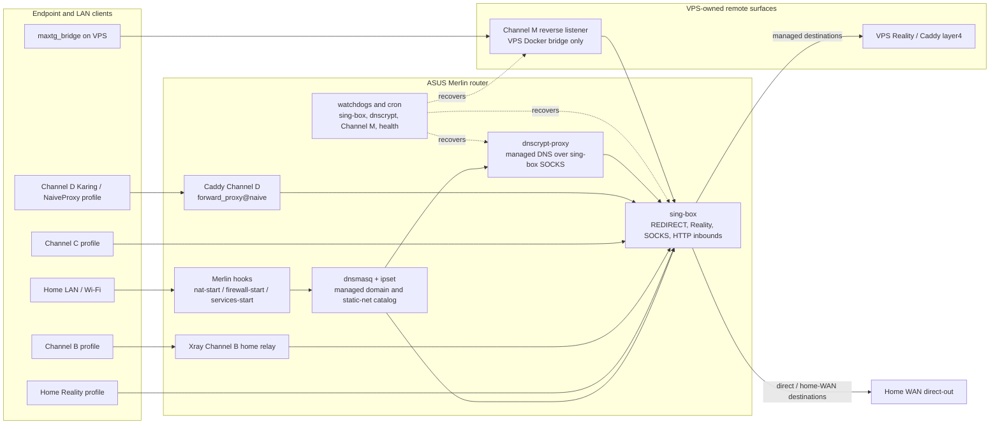
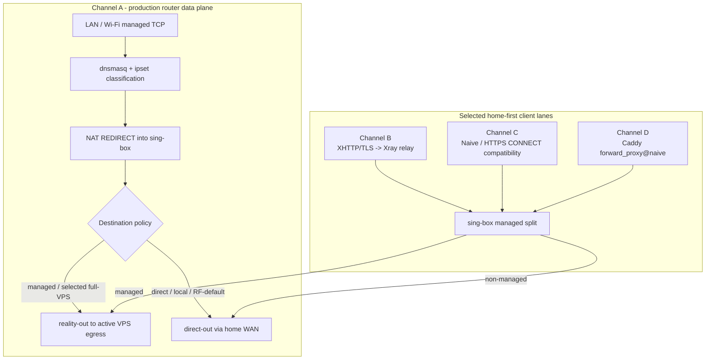
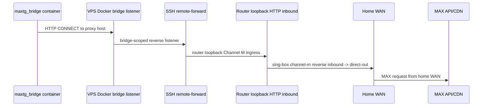
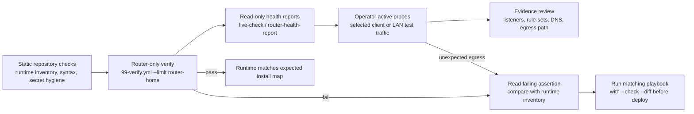
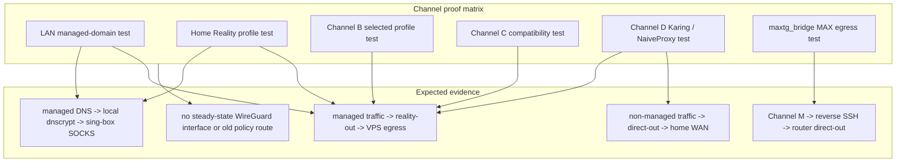

# Router Runtime Map

This document is the operator-facing map of what GhostRoute installs and
manages on the ASUS Merlin router for the current setups. It is a sanitized
expected-runtime view, not a live snapshot: real hosts, numeric ports, client
credentials and deployment-specific values stay in Vault, gitignored
`secrets/`, generated artifacts or health reports.

For the machine-readable source of truth, see
[`configs/runtime-inventory.yml`](/configs/runtime-inventory.yml). For live
verification, run `./verify.sh --verbose` or
`cd ansible && ansible-playbook playbooks/99-verify.yml`.

## At A Glance



## Router-Owned Runtime Objects

| Area | Runtime objects | Installed or rendered by | Verification signal |
|---|---|---|---|
| Merlin boot hooks | `/jffs/scripts/nat-start`, `/jffs/scripts/firewall-start`, `/jffs/scripts/services-start` | `deploy.sh`, routing Ansible roles | `99-verify.yml` checks firewall/NAT rules, cron bootstrap and listener ownership |
| Routing core | `/opt/bin/sing-box`, `/opt/etc/sing-box/config.json`, `/opt/etc/init.d/S99sing-box`, `/opt/etc/sing-box/rule-sets/` | `20-stealth-router.yml`, `singbox_client`, routing-core scripts | REDIRECT listener, Home Reality listener, rule-set mirror, direct/reality routing |
| Catalog DNS | `/jffs/configs/dnsmasq-stealth.conf.add`, `/jffs/configs/dnsmasq-vps-managed.conf.add`, optional selected full-VPS include | `stealth_routing`, DNS catalog inputs | managed domains resolve into `STEALTH_DOMAINS`; direct/RU domains stay out of managed DNS |
| Managed DNS egress | `/opt/sbin/dnscrypt-proxy`, `/opt/etc/dnscrypt-proxy.toml`, `/opt/etc/init.d/S09dnscrypt-proxy2` | `dnscrypt_proxy` | local dnscrypt listener plus sing-box SOCKS listener for dnscrypt |
| Channel B home relay | `/opt/bin/xray`, `/opt/etc/xray/channel-b-home-relay.json`, `/opt/etc/init.d/S99xray-channel-b-home` | `21-channel-b-router.yml`, `channel_b_home_relay` | Channel B listener, firewall allow, connlimit and MSS clamp |
| Channel C native and compatibility lanes | sing-box inbounds and TLS assets under `/opt/etc/sing-box/` | `22-channel-c-router.yml`, `singbox_client` | native Naive and Shadowrocket compatibility listeners plus firewall redirect/allow checks |
| Channel D NaiveProxy lab | `/opt/bin/caddy-channel-d-naiveproxy`, `/opt/etc/caddy/channel-d-naiveproxy/Caddyfile`, `/opt/etc/init.d/S99caddy-channel-d-naiveproxy`, `/opt/share/channel-d-naiveproxy/` | `24-channel-d-router.yml`, `channel_d_naiveproxy` | Caddy listener, config markers, SOCKS upstream, cover-site proof and firewall checks |
| Channel M reverse lane | `/jffs/keys/channel-m-reverse-key`, `/jffs/scripts/channel-m-reverse-tunnel.sh`, services-start cron block | `23-channel-m-reverse.yml` | local router ingress, `ChannelMReverse` cron and VPS reverse listener validation |
| Recovery watchdogs | `/jffs/scripts/singbox-watchdog.sh`, `/jffs/scripts/dnscrypt-watchdog.sh`, Channel M reverse watchdog cron | `singbox_client`, `dnscrypt_proxy`, `23-channel-m-reverse.yml` | minute-level listener probes and targeted restarts or stale tunnel replacement |
| Health monitor | `/jffs/scripts/health-monitor/run-probes`, `aggregate`, `daily-digest`, `lib.sh` | `health_monitor` | hourly probes, aggregate state and daily digest cron jobs |
| Cold fallback | preserved `wgc1_*` NVRAM and `/jffs/scripts/emergency-enable-wgc1.sh` | recovery tooling | WireGuard disabled in steady state; emergency script is manual only |

## Installed Software Versions

Last read-only router snapshot: 2026-06-13, collected through Ansible raw
commands with the same inventory and Vault vars used by `99-verify.yml`.
This table intentionally records only software identity and version data; it
does not include endpoints, listener numbers, credentials or traffic evidence.

| Component | Router-observed version | Source |
|---|---|---|
| Router model | `RT-AX88U_PRO` | `nvram get productid` |
| Asuswrt-Merlin firmware | train `3_0_0_6`, build `102.7`, extend `2` | `nvram get firmver/buildno/extendno`; dots replaced with underscores to avoid IPv4 scanner false positives |
| Linux kernel | `4.19.183` | `uname -r` |
| BusyBox | `1.25.1` | `busybox` banner |
| Entware `opkg` | `80503d94e356476250adaf1f669ee955ec26de76` (`2025-11-05`) | `opkg --version` |
| `sing-box` | Entware package `sing-box-go 1.13.3-2` | `opkg list-installed` |
| `dnscrypt-proxy` | Entware package `dnscrypt-proxy2 2.1.15-1` | `opkg list-installed` |
| Xray | Entware package `xray-core 26.2.6-1` | `opkg list-installed` |
| Channel D Caddy | custom repo-built binary, installed at `/opt/bin/caddy-channel-d-naiveproxy` | local binary managed by `24-channel-d-router.yml`; verify module support via `99-verify.yml` |
| dnsmasq | `2.93-test2` | `dnsmasq --version` |
| iptables | `1.4.15` | `iptables --version` |
| ipset | `7.6`; router prints kernel/userspace protocol warning `6-6` vs `6-7` | `ipset --version` |
| Dropbear SSH | `2025.89` | `dropbear -V` |
| OpenSSL | `3.5.5` | `/opt/bin/openssl version` / `openssl-util 3.5.5-1` |
| Python | `3.13.9` / Entware package `python3 3.13.9-2` | `/opt/bin/python3 --version`, `opkg list-installed` |
| Bash | `5.3.9` / Entware package `bash 5.3-2` | `/opt/bin/bash --version`, `opkg list-installed` |

Go-based router binaries can be memory-sensitive when invoked only to print
their embedded version string. Prefer `opkg list-installed` for Entware-managed
`sing-box`, `dnscrypt-proxy` and Xray versions, and use `99-verify.yml` for
Channel D Caddy module/config proof instead of repeatedly calling the Caddy
binary directly on the router.

## Channel Data Planes



Channel A is the default production router data plane. Channel B is production
for selected device-client profiles. Channel C keeps the Shadowrocket-proven
compatibility lane and the native Naive design. Channel D is a separate
router-native NaiveProxy lab lane; it must not be treated as Channel C proof.

## Channel M Reverse MAX Egress



Channel M is service-only. It is not a client failover channel and does not use
the managed Reality egress, `STEALTH_DOMAINS`, policy DNS or LAN/Wi-Fi routing.
The active reverse lane needs no public home inbound port: the router opens the
SSH remote-forward to the VPS, and the VPS listener stays Docker-bridge scoped.

## Test Schemes

The test schemes below show how to prove the installed runtime without changing
router state. They complement the command checklist in the next section.





Test interpretation:

- Channel A/LAN and Home Reality tests should prove managed DNS plus managed
  traffic through Reality while direct/default destinations stay direct.
- Channel B/C/D tests prove selected home-first client entry and then the same
  managed split. Channel D proof is D-specific and must not be used as Channel
  C native proof.
- Channel M proof is service-specific: MAX traffic should exit through the home
  WAN via reverse SSH, not through the VPS Reality egress.
- WireGuard remains a manual cold fallback and should not appear in steady-state
  proof output.

## Ports And Exposure

The tracked docs use symbolic port names. Numeric values are deployment
material and must stay out of shareable documentation.

| Symbolic listener | Owner | Bind scope | Exposure model |
|---|---|---|---|
| `singbox_redirect_port` | `router_sing_box` | router interfaces | LAN transparent REDIRECT |
| `home_reality_ingress` | `router_sing_box` | router WAN / selected ingress | selected remote clients |
| `channel_b_home_ingress_port` | `router_channel_b_xray_relay` | router WAN / selected ingress | selected Channel B clients |
| `channel_c_native_public_port` | `router_sing_box` | router WAN | selected Channel C clients |
| `channel_c_shadowrocket_public_port` | `router_sing_box` | router WAN | selected compatibility clients |
| `channel_d_naiveproxy_public_port` | `router_channel_d_caddy_naiveproxy` | router WAN | selected Channel D clients |
| `channel_m_maxtg_reverse_ingress_port` | `router_sing_box` | router loopback | SSH remote-forward target only |
| `dnscrypt_port` | `router_dnscrypt_proxy` | router loopback | local managed DNS forwarder |
| `singbox_dnscrypt_socks_port` | `router_sing_box` | router loopback | dnscrypt egress over Reality |

Public firewall exposure must be deliberate, channel-specific and verified by
`99-verify.yml`. Channel M reverse must remain loopback on the router and
Docker-bridge scoped on the VPS side.

## Watchdogs And Recovery Jobs

| Job | Cadence | Purpose |
|---|---:|---|
| `SingBoxWatchdog` | every minute | Probes critical sing-box listeners and restarts only sing-box when they disappear. |
| `DnscryptWatchdog` | every minute | Probes the dnscrypt listener and restarts only dnscrypt-proxy when needed. |
| `ChannelMReverse` | every minute | Validates the reverse SSH tunnel, kills stale sessions and recreates the remote-forward. |
| `RotateSingBoxLog` | hourly | Rotates the sing-box log without changing routing state. |
| `SaveIPSet` | every 6 hours | Persists managed ipset state for router reboot recovery. |
| `DomainAutoAdd` | hourly | Curates auto-discovered domain candidates through the routing-core workflow. |
| `UpdateBlockedList` | daily | Refreshes the controlled blocked-domain list. |
| `HealthMonitorProbes` | hourly | Runs router health probes. |
| `HealthMonitorAggregate` | hourly | Aggregates router health state. |
| `HealthMonitorDaily` | daily | Emits the daily health digest. |

These jobs are recovery and observability guardrails. They must not silently
turn one channel into another, enable WireGuard, change client credentials or
add public listeners.

## Live Verification Checklist

Use read-only checks before and after router changes:

```bash
./verify.sh --verbose
cd ansible
ansible-playbook playbooks/99-verify.yml --limit router-home
./tests/test-runtime-inventory.sh
```

Expected healthy signals:

- `sing-box` REDIRECT, Home Reality, router DNS-forward and dnscrypt SOCKS
  listeners are present.
- `STEALTH_DOMAINS` exists and managed DNS includes route through local
  dnscrypt, while direct/RU domains stay out of the managed include.
- Channel B/C/D checks pass only when the corresponding channel is enabled.
- Channel M reverse checks confirm router cron, local ingress and bridge-scoped
  VPS listener behavior.
- WireGuard steady-state interfaces and old policy routes remain absent.

If a live check disagrees with this map, treat the live check as drift evidence:
read the failing assertion, compare with `configs/runtime-inventory.yml`, then
run the matching playbook in `--check --diff` before any deploy.

## Related Docs

- [`architecture.md`](/docs/architecture.md) - layered routing model.
- [`channels.md`](/docs/channels.md) - channel handoff view.
- [`channel-d.md`](/docs/channel-d.md) - Channel D NaiveProxy lab details.
- [`channel-m-environment.md`](/docs/channel-m-environment.md) - Channel M reverse egress details.
- [`dns-policy.md`](/docs/dns-policy.md) - DNS consistency and leak policy.
- [`runtime-inventory.md`](/docs/runtime-inventory.md) - inventory policy and upgrade gates.
- [`modules/routing-core/README.md`](/modules/routing-core/README.md) - routing-core module ownership.
- [`modules/recovery-verification/docs/failure-modes.md`](/modules/recovery-verification/docs/failure-modes.md) - recovery runbook.
